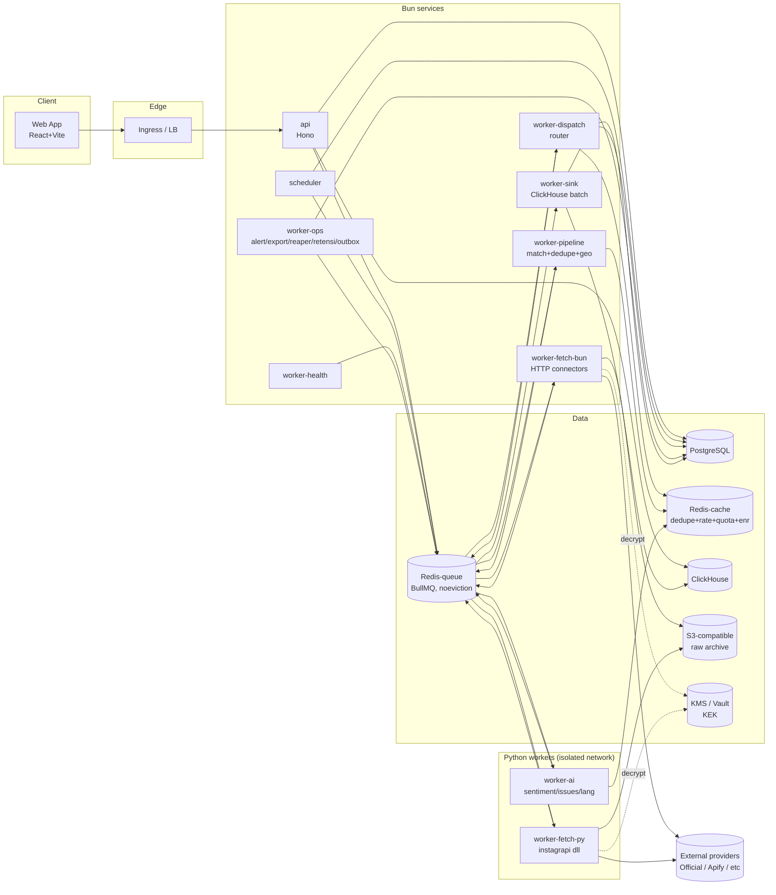

# ARCHITECTURE

## 1. Prinsip

1. **Hexagonal / Ports & Adapters.** `packages/core` = domain + use case, tidak mengimpor apa pun dari connector, DB driver, atau queue lib. Semua I/O lewat *port* (interface).
2. **Provider-agnostic.** Core hanya tahu `platform` + `operation`. Pemilihan provider = tanggung jawab `packages/router`.
3. **Async by default.** API server hanya menulis ke DB/queue dan membaca agregat. Semua kerja berat di worker.
4. **Polyglot worker, satu kontrak.** Worker Bun dan worker Python berbicara dengan **JSON Schema yang sama** (`packages/contracts`).
5. **OLTP ≠ OLAP.** PostgreSQL untuk konfigurasi & state transaksional; ClickHouse untuk konten & analytics; dashboard membaca tabel agregat.
6. **Config-driven.** Enable/priority/weight/rate/quota di DB, di-cache di memori tiap worker, di-invalidate lewat outbox event.

## 2. Tech Stack & Status Kompatibilitas

> Kolom **Bun status** wajib diisi dari hasil spike (TASK fase 0). `UNVERIFIED` = belum boleh dipakai di produksi.

| Layer | Pilihan utama | Alternatif / fallback | Bun status |
|---|---|---|---|
| Runtime | Bun (versi dipin di `.bun-version`) | — | n/a |
| HTTP framework | Hono | Elysia | **WORKAROUND** — SSE butuh `Bun.serve({ idleTimeout: 0 })` (default 10 s memutus SSE) [evidence](evidence/compat/results.md) |
| Validasi | Zod (schema → JSON Schema untuk kontrak) | Valibot / TypeBox | **COMPATIBLE** (zod 4, `z.toJSONSchema` draft 2020-12) |
| PostgreSQL client | `Bun.sql` (built-in) | `postgres` (porsager) | **COMPATIBLE** keduanya (RLS pakai `set_config`, lihat §8) |
| ORM / migrasi | Drizzle ORM + drizzle-kit | SQL murni + migrator sendiri | **COMPATIBLE** (drizzle-orm 0.45, driver `postgres-js` & `bun-sql`); drizzle-kit belum diuji |
| Queue | BullMQ di Redis | Redis Streams (consumer group) implementasi sendiri | **COMPATIBLE** (bullmq 6.3: delay/retry/priority/stalled + interop Python bullmq 3.2). jobId **tanpa `:`** |
| Redis client | ioredis (dibutuhkan BullMQ) | `Bun.redis` untuk non-BullMQ | **COMPATIBLE** (ioredis 6 EVALSHA; `Bun.RedisClient` SET NX EX) |
| Analytics DB | ClickHouse via `@clickhouse/client` (HTTP) | HTTP `fetch` langsung ke ClickHouse | **COMPATIBLE** (client 1.23 × ClickHouse 26.10) |
| Object storage | `Bun.s3` (built-in) → S3 / server S3-compatible yang **masih dirawat** (MinIO OSS diarsipkan — DEPLOYMENT §3) | `@aws-sdk/client-s3` | **COMPATIBLE** (put/get/presign/delete ke versitygw) |
| Password hash | `Bun.password` (argon2id) | — | **COMPATIBLE** |
| JWT | `jose` | — | **COMPATIBLE** (jose 6, EdDSA & ES256) |
| Crypto | Web Crypto (`crypto.subtle`, AES-256-GCM) | — | **COMPATIBLE** (interop Python `cryptography` + Vault transit) |
| Telemetry | OpenTelemetry JS SDK | Log JSON + Prometheus text endpoint manual | **COMPATIBLE** (OTLP/HTTP protobuf + AsyncLocalStorage context) |
| Frontend | React + Vite + TanStack Query + ECharts | — | **COMPATIBLE** untuk `vite build` via `bun --bun` (TanStack/ECharts belum diuji) |
| E2E test | Playwright (dijalankan dengan Node bila perlu) | — | UNTESTED (host spike tanpa dependensi browser) |
| Python worker | Python 3.12, `bullmq` (PyPI), instagrapi, lib AI | Redis Streams consumer | n/a |

Aturan: jika spike gagal → pakai kolom fallback dan catat di `docs/adr/ADR-001-bun-runtime.md`.

## 3. Diagram Komponen



## 4. Alur Data (Ingest End-to-End)

```mermaid
sequenceDiagram
  autonumber
  participant S as scheduler
  participant PG as Postgres
  participant Q as Redis/BullMQ
  participant D as dispatch (router)
  participant F as fetch worker (bun|py)
  participant X as Provider
  participant P as pipeline
  participant A as ai worker
  participant K as sink
  participant C as ClickHouse

  S->>PG: SELECT due crawl_plans FOR UPDATE SKIP LOCKED
  S->>PG: INSERT crawl_runs(status=queued)
  S->>Q: crawl.dispatch {crawl_run_id}
  Q->>D: consume
  D->>D: compile query AST → provider query(s)
  D->>D: Router.select(): filter enabled/capability/health/quota → priority → weight
  D->>Q: fetch.<runtime> {connector, account_id, request}
  Q->>F: consume
  F->>F: acquire rate token + quota reservation
  F->>X: request (credential decrypted in-memory)
  X-->>F: response
  F->>F: normalize → CanonicalItem[]
  F->>Q: fetch.result {outcome, items_ref, usage}
  Q->>D: consume fetch.result
  D->>D: error → reportOutcome() → failover (kembali ke Router.select)
  D->>Q: sukses → pipeline.items {items_ref}
  Q->>P: consume
  P->>P: local AST match, dedupe (Redis-cache SETNX), geo gazetteer
  P->>Q: ai.enrich (post match, batch)
  P->>Q: sink.analytics (post tak-match, matches=[])
  Q->>A: consume
  A->>Q: sink.analytics {enriched items}
  Q->>K: consume (micro-batch)
  K->>C: INSERT posts, topic_match_events, engagement_snapshots
  C->>C: Materialized views → agg_* tables
  K->>PG: UPDATE crawl_runs(status, counts), crawl_plans(high_watermark hanya jika succeeded; gap_windows jika partial)
  K->>Q: realtime.notify {tenant, topic}
```

## 5. Service Catalog

| Service | Runtime | Tanggung jawab | Scale by | Stateful? |
|---|---|---|---|---|
| `api` | Bun | REST + SSE, auth, CRUD config, baca agregat | CPU/RPS | Tidak |
| `scheduler` | Bun | Tick tiap 15 s, enqueue run yang jatuh tempo, leader election via Redis lock | 2 replika (1 aktif) | Tidak |
| `worker-dispatch` | Bun | Query compile, routing, failover decision | queue depth `crawl.dispatch` + `fetch.result` | Tidak |
| `worker-fetch-bun` | Bun | Menjalankan connector runtime `bun` (twitterapi.io, Apify REST, YouTube Data API, official API, dsb.) | depth `fetch.bun` | Tidak |
| `worker-fetch-py` | Python | Menjalankan connector runtime `python` (instagrapi, dsb.) | depth `fetch.py` | Session cache (terenkripsi di Redis/PG) |
| `worker-pipeline` | Bun | Match lokal, dedupe, geo, is_ad | depth `pipeline.items` | Tidak |
| `worker-ai` | Python | Bahasa, sentiment, **emotion (8 emosi)**, keyphrase (batch GPU/CPU) + **demografi per akun (gender/age, di-cache)** + LLM fallback | depth `ai.enrich` | Model di memori |
| `worker-sink` | Bun | Batch insert ClickHouse, update run state | depth `sink.analytics` | Tidak |
| `worker-health` | Bun | Active probe, hitung health score, circuit transitions | cron | Tidak |
| `worker-ops` | Bun | Engagement refresh, alert evaluation, export, reprocess, retensi | per queue | Tidak |
| `web` | static | SPA dilayani CDN/nginx | — | — |

**Mengapa Python terpisah:** instagrapi adalah library Python; banyak model NLP Bahasa Indonesia tersedia di ekosistem Python (transformers). Menjalankannya di proses/container terpisah = memenuhi aturan "unofficial API tidak berjalan di API server" dan mengisolasi risiko (egress, crash, ban).

## 6. Layering di dalam kode

```
apps/*            → composition root (wiring adapters ke ports), tanpa business logic
packages/core     → entities, value objects, use-cases, ports (interfaces)
packages/router   → implementasi ProviderRouter port (policy, health, rate, quota)
packages/connector-sdk → interface Connector + helper + contract test harness
packages/connectors/* → adapter per provider×platform (SATU-SATUNYA tempat logic provider)
packages/db, analytics, queue, crypto, observability → adapter infrastruktur
```

Aturan dependency (dicek oleh lint `dependency-cruiser` atau script custom — kompat Bun diverifikasi):

| From \ To | core | router | connector-sdk | connectors/* | db/queue/analytics |
|---|---|---|---|---|---|
| core | — | ✗ | ✗ | ✗ | ✗ |
| router | ✓ | — | ✓ | ✗ | ✓ (via port) |
| connectors/* | ✗ | ✗ | ✓ | ✗ (antar connector) | ✗ |
| apps/* | ✓ | ✓ | ✓ | ✓ (registry) | ✓ |

## 7. Struktur Folder

```
social-intel/
├── apps/
│   ├── api/
│   │   ├── src/
│   │   │   ├── main.ts                 # bootstrap Hono, DI container
│   │   │   ├── routes/
│   │   │   │   ├── auth.ts
│   │   │   │   ├── topics.ts
│   │   │   │   ├── analytics.ts
│   │   │   │   ├── posts.ts
│   │   │   │   ├── alerts.ts
│   │   │   │   ├── exports.ts
│   │   │   │   ├── stream.ts           # SSE
│   │   │   │   └── admin/
│   │   │   │       ├── providers.ts
│   │   │   │       ├── connectors.ts
│   │   │   │       ├── accounts.ts
│   │   │   │       ├── routing.ts
│   │   │   │       ├── quotas.ts
│   │   │   │       └── usage.ts
│   │   │   ├── middleware/ (auth, tenant, rbac, rate-limit, request-id, error)
│   │   │   └── dto/                    # zod schemas request/response
│   │   └── test/
│   ├── scheduler/src/{main.ts, tick.ts, leader.ts}
│   ├── worker-dispatch/src/{main.ts, dispatch.ts, failover.ts}
│   ├── worker-fetch-bun/src/{main.ts, execute.ts}
│   ├── worker-pipeline/src/{main.ts, match.ts, dedupe.ts, geo.ts}
│   ├── worker-sink/src/{main.ts, batcher.ts}
│   ├── worker-health/src/{main.ts, probe.ts, score.ts}
│   ├── worker-ops/src/{engagement-refresh.ts, alerts.ts, exports.ts, reprocess.ts, retention.ts}
│   └── web/
│       ├── src/{pages, components, features, api, charts, hooks, stores}
│       └── vite.config.ts
├── packages/
│   ├── core/
│   │   └── src/
│   │       ├── domain/ (topic.ts, query-ast.ts, post.ts, sentiment.ts, platform.ts, operation.ts)
│   │       ├── ports/  (ProviderRouter.ts, JobQueue.ts, TopicRepo.ts, AnalyticsReader.ts, SecretStore.ts, Clock.ts)
│   │       └── usecases/ (CreateTopic.ts, ScheduleDueRuns.ts, DispatchRun.ts, IngestItems.ts, OverrideSentiment.ts ...)
│   ├── query/          # parser boolean → AST, matcher lokal, compiler berbasis feature flag
│   ├── contracts/      # JSON Schema + TS types (CanonicalItem, queue envelopes) → di-generate juga ke Python (pydantic)
│   ├── connector-sdk/  # Connector interface, ConnectorError, test harness, fixtures loader
│   ├── connectors/
│   │   ├── fake/                  # connector deterministik untuk test & chaos
│   │   ├── twitterapi-io-x/       # X utama (PROVIDER_MATRIX §6.1)
│   │   ├── apify/                 # SATU paket untuk semua actor Apify (aturan dependensi melarang connector saling impor):
│   │   │                          #   client.ts (run/poll/dataset, maxTotalChargeUsd, memory), actor.ts (connector generik + async resume),
│   │   │                          #   x-xquik, x-apidojo, instagram-boolean, facebook-scraperone, tiktok-apidojo, youtube-streamers, threads-scrapersdelight (I-17/I-18)
│   │   ├── x-official/            # X cadangan mahal
│   │   ├── scrapecreators-*/      # vendor non-Apify (IG/TikTok/Threads/YouTube)
│   │   ├── youtube-data-api/
│   │   ├── threads-official/      # bila S-13 membuktikan keyword search
│   │   ├── meta-graph-instagram/  # hashtag/akun bisnis sendiri
│   │   ├── python-remote/         # manifest-only: mendeskripsikan connector runtime=python
│   │   └── index.ts               # registry: export semua manifest
│   ├── router/        # policy loader, selector, health, circuit breaker, rate limiter, quota
│   ├── queue/         # JobQueue port impl (BullMQ) + envelope + tracing propagation
│   ├── db/            # drizzle schema, migrations/, RLS helpers, repos
│   ├── analytics/     # ClickHouse client, DDL migrations, query builders (baca agg_*)
│   ├── crypto/        # envelope encryption, KMS adapters (vault, aws-kms, local-dev)
│   ├── observability/ # logger, metrics, tracing
│   └── config/        # env parsing (zod), feature flags
├── workers-py/
│   ├── pyproject.toml
│   ├── smip_contracts/            # pydantic models hasil generate dari packages/contracts
│   ├── connector_worker/
│   │   ├── main.py                # consumer fetch.py
│   │   ├── base.py                # BaseConnector (mirror interface TS)
│   │   ├── errors.py
│   │   └── connectors/
│   │       └── instagrapi_instagram/
│   └── ai_worker/
│       ├── main.py                # consumer ai.enrich
│       ├── lang.py, sentiment.py, keyphrase.py, llm_fallback.py
│       └── models/                # di-mount, bukan di-commit
├── infra/
│   ├── docker/ (Dockerfile.bun, Dockerfile.py, Dockerfile.web)
│   ├── compose/docker-compose.yml
│   ├── helm/smip/
│   └── clickhouse/, postgres/ (init, config)
├── scripts/ (gen-contracts.ts, seed.ts, compat-check.ts)
├── docs/
├── bunfig.toml
├── package.json  (workspaces)
└── tsconfig.base.json
```

## 8. Multi-tenancy

- **Postgres**: kolom `tenant_id` + RLS policy `tenant_id = nullif(current_setting('app.tenant_id', true), '')::uuid`. Koneksi API men-set konteks per transaksi dengan `SELECT set_config('app.tenant_id', $1, true)` — **bukan** `SET LOCAL … = $1` (Postgres menolak parameter di `SET`). `nullif` wajib: setelah transaksi selesai, koneksi pool mengembalikan `''` (bukan NULL) sehingga cast `::uuid` meledak. Keduanya terbukti di S-08. Role DB `app_rw` tidak punya `BYPASSRLS`; hanya worker sistem memakai role `system_rw` untuk tabel global.
- **ClickHouse**: konten `posts` global (dedupe lintas tenant — data publik yang sama tidak disimpan dua kali); semua tabel yang terkait tenant (`topic_match_events`, `agg_*`) punya `tenant_id` di prefix ORDER BY. Query builder **wajib** menyisipkan `tenant_id` (tidak ada raw SQL dari route). Opsional: ClickHouse row policy per user DB tenant.
- **Redis**: key diberi prefix `t:{tenant_id}:` untuk data tenant. Dua peran terpisah: Redis-queue (`noeviction`) dan Redis-cache/dedupe (DATA_MODEL §7).
- **Credential**: `provider_accounts.tenant_id NULL` = shared pool operator; non-null = BYO milik tenant, hanya bisa dipakai routing untuk tenant tsb.

## 9. Konsistensi & Idempotency

- Setiap job punya `idempotency_key`; BullMQ `jobId` = key tsb → enqueue ganda diabaikan. **Format key memakai `.` bukan `:`** (BullMQ 6 menolak `:` di custom jobId — S-03).
- Insert ClickHouse memakai `insert_deduplication_token` = `batch_id`. Terbukti di S-07 (ClickHouse 26.10): untuk MergeTree non-replicated **wajib** SETTING tabel `non_replicated_deduplication_window > 0` — tanpa itu token diabaikan diam-diam. worker-sink men-set `async_insert` eksplisit (server 26.10 default `async_insert=1`) agar perilaku tidak bergantung default versi.
- Perubahan config di Postgres ditulis bersama row `outbox` dalam satu transaksi; publisher mengirim ke Redis pub/sub `config.changed`; semua worker invalidate cache.
- **Dedupe tidak boleh 100% bergantung Redis.** Redis-queue (`noeviction`) dipisah dari Redis-cache/dedupe; worker-sink menambah guard sisi ClickHouse sebelum insert `sign=+1` (DATA_MODEL §6.2) sehinga kehilangan key Redis tidak menyebabkan double-count.
- **Reaper** membersihkan `crawl_plans.inflight_run_id` untuk run yang mandek (DATA_MODEL §3.9, QUEUE_SPEC §6) agar plan tidak beku bila worker mati.

## 10. Menambah Platform Baru (tanpa ubah core)

1. `INSERT INTO platforms (code, name, content_types, …)`.
2. Buat connector di `packages/connectors/<provider>-<platform>` (atau Python) yang memenuhi `Connector` interface + lulus contract suite.
3. Daftarkan manifest di registry → saat boot, worker melakukan `upsert` ke tabel `connectors` + `connector_capabilities (declared)`.
4. Jalankan verifikasi capability (job `connector.verify`) → status `verified`.
5. Buat `routing_policy` + `routing_rules` untuk platform tsb.
6. UI membaca daftar platform dari `GET /v1/platforms` → checkbox otomatis muncul.

Tidak ada perubahan di `packages/core`, `apps/api` route analytics, maupun schema ClickHouse (kolom `platform` adalah `LowCardinality(String)`, bukan enum).

## 11. Keputusan Arsitektur (ringkas — detail di `docs/adr/`)

| ADR | Keputusan |
|---|---|
| 001 | Bun sebagai runtime utama + compat matrix wajib |
| 002 | PostgreSQL (OLTP) + ClickHouse (OLAP) |
| 003 | Python worker terpisah untuk library non-JS & inference AI |
| 004 | BullMQ di Redis sebagai queue (abstraksi `JobQueue` agar bisa diganti) |
| 005 | Post global + topic match per tenant |
| 006 | Local AST matcher sebagai sumber kebenaran semantik query |
| 007 | Inferensi demografi (gender/age) — agregat, dengan kontrol UU PDP |
| 008 | Model query: boolean + keyword + media tags + multi-language (id/en/ms) |
| 009 | Collection stream (dedup fetch antar topic beririsan) — optimasi biaya near-term |

## 12. Collection Stream (dedup fetch antar topic) — near-term

**Masalah.** Model crawl saat ini membuat `crawl_plans` per (`topic_query` × platform × operation). Dua topic dengan keyword beririsan **fetch terpisah dan membayar dua kali** ke provider. Pada 108 topic, faktor tumpang tindih ~4× → biaya data membengkak s/d **2,45×** (COST_MODEL §6). `posts` sudah global (ADR-005) sehingga *penyimpanan* & *AI* tidak dobel lintas tenant, tapi *fetch* masih dobel.

**Solusi (additive, tidak merombak model crawl).** Sebuah **dedup planner** mengambil semua `topic_queries` aktif, mengekstrak term positif, dan menggabungkannya menjadi himpunan **collection stream** minimal per (platform, operation). Fetch dilakukan **per stream sekali**; **local matcher** (dengan inverted-index, CONNECTOR_SPEC §5) memetakan tiap post ke **semua** topic_query yang cocok — lintas tenant, karena post global.

```
Topic A (tenant 1): "banjir" OR "bencana"
Topic B (tenant 2): "bencana" OR "gempa"
Topic C (tenant 1): "banjir" AND "jakarta"
        ↓ dedup planner
Stream: {banjir, bencana, gempa}  → fetch sekali → matcher → {A, B, C}
```
`AND`/`NOT`/urutan tetap dievaluasi local matcher (recall dari stream, presisi dari AST — ADR-006). Post yang tak match topic mana pun **tetap disimpan** (murah) untuk backfill topic baru tanpa fetch ulang berbayar; hanya post yang match yang masuk `ai.enrich` (hemat AI — "match-before-enrich").

**Sifat additive.** `collection_streams` + `stream_topic_links` (DATA_MODEL §3.11) menggabung `crawl_plans` yang setara; kalau planner dimatikan, sistem jatuh balik ke crawl per-query. Detail keputusan: ADR-009.

**Tiga aturan yang wajib (koreksi v0.4):**
1. **Per kelas interval.** Stream dibentuk per (platform, operation, `interval_class`). Menggabung semua term ke satu stream dengan interval = min anggota membuat topic 1 jam ikut ditarik tiap 5 menit — biaya naik, kebalikan tujuan ADR-009. Term yang dipakai topic 5m dan topic 1h cukup ada di stream 5m; topic 1h menerima match dari stream itu.
2. **Kepemilikan & atribusi biaya.** Run stream = system-owned (`crawl_runs.tenant_id NULL`); biaya dialokasikan ke tenant proporsional jumlah match (DATA_MODEL §3.11) sehingga quota & cost guard per tenant tetap berlaku.
3. **BYO credential tidak boleh melayani tenant lain.** Stream lintas tenant hanya memakai akun shared pool; tenant dengan routing BYO mendapat stream `private:{tenant_id}` (R-13).
