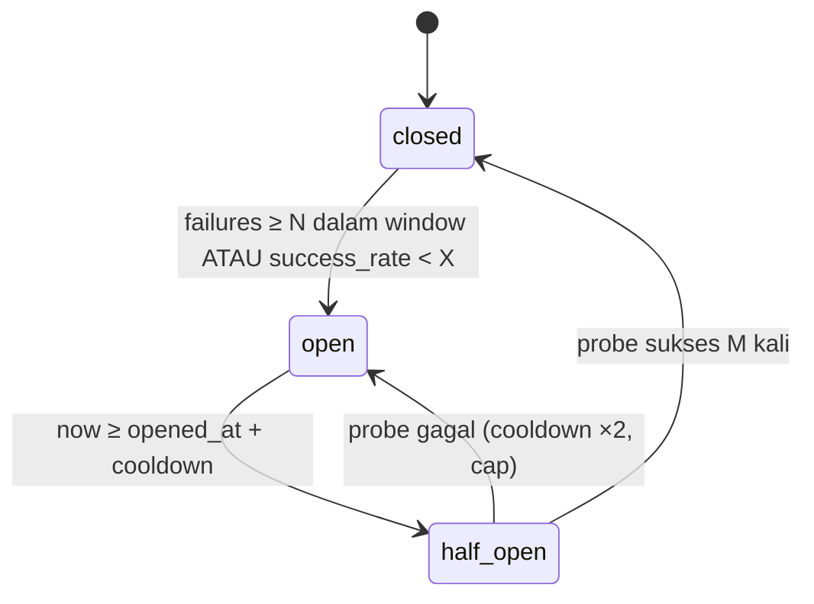

# CONNECTOR SPEC

Dokumen ini mendefinisikan **kontrak** antara core dan provider. Semua logic spesifik provider berada **hanya** di dalam connector.

---

## 1. Konsep

```
Business logic (core)
   │  ProviderRouter.plan({ platform, operation, … }) → fetch → reportOutcome()
   ▼
ProviderRouter (packages/router)
   │  pilih connector+account berdasarkan policy, capability, health, rate, quota
   ▼
Connector (packages/connectors/* atau workers-py/connectors/*)
   │  fetch() + normalize() → CanonicalItem[]
   ▼
Provider eksternal
```

- **Provider** = entitas bisnis (twitterapi.io, Apify, Meta, X, Google, instagrapi).
- "Router.execute" di PRD = istilah konsep; port nyata = `ProviderRouter.plan()` + `reportOutcome()` (§6.1).
- **Connector** = kode untuk provider × platform. Satu provider bisa punya banyak connector.
- **Operation** = kosakata tetap milik core. Menambah operation = perubahan core yang disengaja (jarang).

### Operation enum (v1)

| Operation | Input utama | Output |
|---|---|---|
| `search_keyword` | compiled query + window | post/reply |
| `search_hashtag` | hashtag + window | post |
| `user_timeline` | platform user id/handle + window | post/reply/repost |
| `post_comments` | post id | comment/reply |
| `post_detail` | post id[] | post + metrics terbaru (engagement refresh) |
| `profile` | handle/id[] | author |
| `health_probe` | — (connector memilih request termurah) | ok/fail |

---

## 2. Connector Manifest

Manifest adalah **deklarasi statis** yang diekspor oleh connector. Saat worker boot, manifest di-upsert ke tabel `connectors` & `connector_capabilities` (status `declared`). Capability baru boleh dipakai produksi setelah **verified** (lihat §9).

```ts
// packages/connector-sdk/src/manifest.ts
export type Runtime = "bun" | "python";

export type QueryFeature =
  | "term" | "phrase" | "or" | "and" | "not" | "group"
  | "lang_filter" | "since" | "until";

export interface OperationSupport {
  queryFeatures: QueryFeature[];      // fitur boolean yang DIDUKUNG provider secara native
  maxQueryLength: number | null;      // null = tidak diketahui → compiler memecah query per term
  supportsSince: boolean;
  supportsUntil: boolean;
  supportsCursor: boolean;
  maxPageSize: number | null;         // null = tidak diketahui
  returnsFields: string[];            // path CanonicalItem yang diisi, mis. "metrics.likes"
  asyncExecution: boolean;            // true = provider berbasis "run" (start → poll → result)
  resultOrder: "desc" | "asc" | null; // urutan hasil (terbaru dulu/terlama dulu) — untuk celah partial success (§7)
}

export interface ConnectorManifest {
  key: string;                         // "apify.instagram"
  version: string;                     // semver
  providerKey: string;                 // "apify"
  platform: string;                    // "instagram"
  runtime: Runtime;
  displayName: string;
  credentialKinds: Array<"api_key" | "oauth2" | "session" | "basic" | "cookie_jar" | "none">;
  configSchema: JSONSchema;            // config non-rahasia (actor id, input template, base url)
  operations: Partial<Record<Operation, OperationSupport>>;
  costModel: {                         // HANYA jenis unit — angka harga TIDAK di kode
    unit: "request" | "result" | "compute_unit" | "credit" | "unknown";
    reportsUsageInResponse: boolean;   // apakah response provider membawa info biaya
  };
  docsUrl: string;                     // sumber fakta
}
```

**Dilarang** di manifest: angka rate limit, angka harga, klaim capability yang belum dites. Angka-angka tsb masuk DB (`rate_limit_policies`, `quota_policies`, `PROVIDER_MATRIX.md`) dengan `source_ref`.

---

## 3. Connector Interface (TypeScript)

```ts
// packages/connector-sdk/src/connector.ts
export interface Connector {
  readonly manifest: ConnectorManifest;

  /** Dipanggil sekali per worker per (connector, config version). */
  init?(ctx: ConnectorInitContext): Promise<void>;

  /** Satu halaman/eksekusi fetch. Wajib menghormati ctx.signal (deadline). */
  fetch(req: FetchRequest, ctx: ConnectorContext): Promise<FetchResult>;

  /** Request termurah untuk membuktikan credential + endpoint hidup. */
  healthProbe(ctx: ConnectorContext): Promise<HealthProbeResult>;

  /** Opsional: kompilasi AST → query native. Default: compiler generik berbasis queryFeatures. */
  compileQuery?(ast: QueryAst, op: Operation): CompiledQuery[];

  /** Opsional: untuk provider asinkron (run-based) — lanjutkan run yg sudah dimulai. */
  resume?(handle: AsyncHandle, ctx: ConnectorContext): Promise<FetchResult>;

  dispose?(): Promise<void>;
}

export interface ConnectorContext {
  credential: DecryptedCredential;     // hanya ada di memori, tidak pernah di-log
  config: Record<string, unknown>;     // sudah divalidasi configSchema
  http: HttpClient;                    // fetch wrapper: timeout, tracing, redaction, egress policy
  logger: Logger;                      // otomatis redact
  signal: AbortSignal;                 // deadline job
  reportRateLimit(info: RateLimitInfo): void;   // header provider → router
  archiveRaw(page: unknown, meta: RawMeta): Promise<string>; // → raw_ref (S3)
}

export interface FetchRequest {
  requestId: string;             // uuidv7
  idempotencyKey: string;        // run.{crawl_run_id}.attempt.{n}.page.{p} — tanpa ':' (BullMQ jobId)
  platform: string;
  operation: Operation;
  query?: CompiledQuery;         // untuk search_*
  targetIds?: string[];          // untuk post_detail/profile/user_timeline/post_comments
  window?: { since?: string; until?: string };   // ISO-8601
  cursor?: string | null;        // opaque milik connector
  pageLimit: number;             // batas halaman per job
  maxItems: number;
  asyncHandle?: AsyncHandle;     // jika melanjutkan run
}

export interface FetchResult {
  items: CanonicalItem[];
  nextCursor: string | null;
  hasMore: boolean;
  asyncHandle?: AsyncHandle;     // jika run belum selesai → dispatcher menjadwalkan resume
  rawRefs: string[];
  usage: {
    requests: number;
    results: number;
    costUnits: number | null;    // null jika provider tidak melaporkan
    costUnitLabel: string | null;
  };
  upstream: { httpStatuses: number[]; requestIds: string[] };
  warnings: Array<{ code: string; message: string }>;
}

export interface HealthProbeResult {
  ok: boolean;
  latencyMs: number;
  errorCode?: ConnectorErrorCode;
  details?: Record<string, unknown>;   // sudah di-redact
}

export interface AsyncHandle { kind: string; id: string; startedAt: string; pollAfterMs: number }
```

### 3.1 Python mirror

```python
# workers-py/connector_worker/base.py
class BaseConnector(ABC):
    manifest: ConnectorManifest            # pydantic, generate dari packages/contracts

    async def init(self, ctx: InitContext) -> None: ...
    @abstractmethod
    async def fetch(self, req: FetchRequest, ctx: ConnectorContext) -> FetchResult: ...
    @abstractmethod
    async def health_probe(self, ctx: ConnectorContext) -> HealthProbeResult: ...
```
Kontrak identik diverifikasi oleh **contract suite yang sama** (fixture JSON dijalankan terhadap kedua runtime).

---

## 4. Canonical Item Schema

Sumber: `packages/contracts/schemas/canonical-item.v1.json` (JSON Schema draft 2020-12). Ringkasan:

```json
{
  "schema": "canonical-item/v1",
  "platform": "instagram",
  "platform_post_id": "3456789012345678901",
  "content_type": "post",
  "url": "https://www.instagram.com/p/XXXX/",
  "text": "Demo di depan gedung DPR hari ini ...",
  "lang_hint": null,
  "published_at": "2026-08-28T03:21:00.000Z",
  "parent": null,
  "root_post_id": null,
  "author": {
    "platform_user_id": "1234567",
    "handle": "infowarga_id",
    "display_name": "Info Warga",
    "followers": 10234,
    "following": null,
    "verified": false,
    "created_at": null,
    "location_raw": "Jakarta",
    "avatar_url": "https://..."
  },
  "metrics": {
    "likes": 120, "comments": 14, "shares": null, "views": null, "quotes": null, "saves": null,
    "captured_at": "2026-08-28T03:25:10.000Z"
  },
  "hashtags": ["demodpr"],
  "mentions": [],
  "media": [{ "type": "image", "url": "https://..." }],
  "geo": { "lat": null, "lng": null, "place_name": null },
  "is_ad": null,
  "extra": { "apify": { "shortCode": "XXXX" } },
  "provenance": {
    "connector_key": "apify.instagram",
    "connector_version": "1.2.0",
    "fetched_at": "2026-08-28T03:25:10.000Z",
    "raw_ref": "s3://smip-raw/raw/instagram/apify.instagram/2026/08/28/<run>/1-1.json.gz"
  }
}
```

Aturan normalisasi:
1. Field yang tidak disediakan → `null`. **Dilarang** mengisi 0/string kosong sebagai pengganti "tidak tahu".
2. `published_at` wajib ISO-8601 UTC. Jika provider hanya memberi waktu relatif → connector wajib menolak item (warning `UNPARSEABLE_TIMESTAMP`), tidak menebak.
3. `extra.<providerKey>` boleh berisi data mentah tambahan; **core dilarang membaca `extra`**.
4. `platform_post_id` = ID native platform (bukan ID provider) agar dedupe lintas provider bekerja. Jika provider tidak memberi ID native → item ditandai `warnings: NO_NATIVE_ID` dan dedupe memakai `sha256(platform|url)`.
5. Repost/retweet/quote: `content_type = "repost"|"quote"`, `parent` = `{ "platform_post_id": <post asli>, "author": { "platform_user_id": <id asli>, "handle": <handle asli> } }`. `parent.author` **wajib diisi bila tersedia** — dipakai untuk widget "Most Reposted Accounts" (`agg_reposted_author_1d`). Jika provider tidak memberi penulis asli → `parent.author = null` (jangan tebak).

---

## 4a. Aturan biaya (`usage`) & Facebook page-list

**`usage.results` dan `usage.costUnits` = jumlah/biaya hasil yang DIKEMBALIKAN provider, bukan yang kita simpan atau yang unik.** Provider menagih untuk apa yang mereka kirim. Ini load-bearing untuk akurasi biaya (COST_MODEL §3):
- Connector **wajib** melaporkan `usage` dari hasil yang diterima dari provider, sebelum dedupe/filter lokal.
- Anti-pattern (dilarang): menghitung `usage` dari post yang akhirnya tersimpan → pelacakan biaya terlihat sehat sementara tagihan membengkak.
- **Minimum per request ikut dihitung.** Provider seperti twitterapi.io menagih minimum per request walau hasil kosong (PROVIDER_MATRIX §6.1) → `costUnits` = `max(min_per_request, per_result × results)` per request, dijumlah per halaman. Poll kosong ≠ gratis.
- Karena `usage` bagian dari `FetchResult` (bukan efek samping), connector yang tidak melaporkan biaya gagal type-check — kesalahan yang mungkin jadi kesalahan yang mustahil.

**Facebook page-list.** FB tidak punya keyword search publik (PROVIDER_MATRIX §4b). Connector FB membaca daftar **Page** dari keyword berbentuk URL `facebook.com/...` atau `page:<nama>`. **Stream FB tanpa Page terkonfigurasi → `fetch` mengembalikan hasil kosong dengan `usage` nol tanpa memanggil provider** (jangan jalankan run yang pasti sia-sia tapi tetap ditagih).

## 5. Query Compilation

1. User menulis query → `packages/query` parse → AST (DATA_MODEL §3.8). **`keywords`** (§3.5) di-OR-kan ke AST sebagai node `term` tambahan sebelum kompilasi.
2. Dispatcher memanggil `compileQuery(ast, op)` milik connector atau compiler generik:
   - Jika semua node AST didukung `queryFeatures` dan panjang ≤ `maxQueryLength` → 1 query native.
   - Jika tidak → **decompose** ke DNF lalu ambil himpunan *positive terms/phrases* minimal; setiap term jadi 1 sub-query. `NOT`/`AND` yang tidak didukung dievaluasi oleh local matcher.
3. **Local matcher** (worker-pipeline) mengevaluasi AST asli pada `text` (+ hashtags) setiap item → hanya item yang lolos yang menjadi topic match. Ini menjamin semantik identik apa pun provider-nya. Local matcher juga menerapkan:
   - **`languages`**: item ditolak bila `lang` terdeteksi tidak termasuk `languages` query (kecuali kosong = semua).
   - **`media_tags`** / **`not_media_tags`**: item wajib mengandung ≥1 `media_tags` (bila diisi) dan **tidak** mengandung `not_media_tags`. (Makna tag = tag/label konten pada item; **verifikasi** ke produk — lihat DATA_MODEL §3.5.)
4. Normalisasi teks untuk matching: lowercase, NFKC, hapus diakritik, `#tag` dicocokkan juga sebagai term.

Contoh: `("demo" OR "unras") AND NOT "2025"` + `keywords:["unjuk rasa"]` pada connector yang hanya dukung `term` → 3 sub-query: `demo`, `unras`, `unjuk rasa`; `NOT 2025` + filter `languages`/`media_tags` dievaluasi lokal.

**Platform/connector tanpa keyword search (operation `search_hashtag`)** — sejak 2026-09-28 IG & FB **punya** connector keyword (PROVIDER_MATRIX §2.0); aturan di bawah berlaku untuk connector hashtag-only (mis. `apidojo/instagram-scraper`, Graph API) yang dipakai sebagai cadangan recall. Compiler generik menurunkan hashtag dari setiap term/frasa positif: hapus spasi & tanda baca, lowercase (`"koperasi merah putih"` → `koperasimerahputih`), ditambah hashtag eksplisit di query. Satu hashtag = satu sub-query. Local matcher tetap mengevaluasi AST asli pada caption+hashtag. Recall lebih rendah dari keyword search → UI wajib tooltip "IG: hanya post ber-hashtag". Meta Graph API membatasi 30 hashtag unik/7 hari per akun → router memperlakukannya sebagai quota `unique_hashtags` (DATA_MODEL §4.9, unit `requests` dengan kunci hashtag) sehingga hashtag ke-31 dieliminasi, bukan gagal di provider.

Estimasi biaya (FR-T05), per platform, memakai connector utama policy:
```
requests/hari = sub_query × (86400 / interval_sec) × halaman_rata2        (halaman dari `measured`, default 1)
hasil/hari    = estimasi_match_per_hari (dari /topics/preview) × overhead_platform (COST_MODEL §3)
biaya/hari    = hasil/hari × tarif_per_hasil + requests/hari × tarif_min_per_request   (+ biaya run untuk provider run-based)
```
Menghitung **request saja** (rumus v0.3) salah orde besaran untuk provider yang menagih per hasil. Tarif dibaca dari `quota_policies`/PROVIDER_MATRIX (DOCS/TESTED); bila tarif `UNVERIFIED`, UI menampilkan estimasi dengan label "belum terverifikasi".

> **Skalabilitas local matcher (banyak topic).** Mencocokkan tiap item ke seluruh AST topic secara naif = O(item × topic) dan tidak skala pada 100+ topic (produk referensi punya 108). Solusi (analog *percolator* tapi di stack kita, bukan OpenSearch): bangun **inverted index term → daftar topic_query kandidat** di memori worker (di-refresh dari config, invalidate via outbox). Untuk tiap item: ambil kandidat via term yang muncul, baru evaluasi AST penuh hanya pada kandidat. Biaya matching jadi ~O(item × kandidat), bukan × total topic. Ini juga fondasi **collection stream** (ARCHITECTURE §12): satu fetch → banyak topic match.

---

## 6. Router

### 6.1 Port di core
```ts
// packages/core/src/ports/ProviderRouter.ts
export interface ProviderRouter {
  plan(input: RouteInput): Promise<RouteDecision>;          // pilih connector+account
  reportOutcome(o: AttemptOutcome): Promise<FailoverDecision>;
}
export interface RouteInput {
  tenantId: string; platform: string; operation: Operation;
  runKind: "incremental" | "backfill" | "engagement_refresh" | "verify";
  requiredFeatures: QueryFeature[]; intervalSec: number;
  excludeConnectorIds: string[]; excludeAccountIds: string[];
  estimatedUnits: { requests: number; results: number };
}
export type RouteDecision =
  | { kind: "selected"; connectorId: string; connectorKey: string; runtime: Runtime;
      accountId: string; reservationId: string; attemptNo: number }
  | { kind: "none_available"; reason: NoRouteReason; retryAfterMs: number };
```

### 6.2 Algoritma seleksi (`priority_weighted`)

```text
function plan(input):
  policy ← policies[(input.tenantId, platform, op)] ?? policies[(GLOBAL, platform, op)]
  if !policy or !policy.enabled → none_available(NO_POLICY)

  candidates ← for rule in policy.rules:
       require rule.enabled
       require connector.enabled AND provider.enabled
       cap ← capabilities[connector, op]
       require cap.status == 'verified' OR policy.allow_unverified
       require input.requiredFeatures ⊆ cap.declared.query_features OR compiler can decompose
       require input.intervalSec ≥ cap.measured.min_interval_sec (jika diketahui)
       require rule.conditions match input.runKind
       require connector.id ∉ input.excludeConnectorIds
       require share(rule, 1h) < rule.max_share_pct (jika diset)
       accounts ← eligible accounts:
            (tenant_id = input.tenantId OR tenant_id IS NULL),
            status='active', cooldown_until < now, id ∉ excludeAccountIds,
            circuit(connector,account) ≠ 'open'  (half_open → max 1 probe inflight)
       require accounts non-empty

  groups ← group candidates by rule.priority ASC
  for group in groups:
      pool ← [(rule, account) for each candidate×account]
      effectiveWeight(rule,account) = rule.weight × healthFactor(score) 
              where healthFactor = 1.0 (healthy) | 0.5 (degraded) | 0.1 (half_open)
      standby rules (weight=0) hanya dipakai jika semua weight>0 di group gagal reservasi
      while pool non-empty:
          pick ← weightedRandom(pool)
          if tryReserve(pick):        // atomic Lua: rate tokens + semaphore + quota (all scopes)
               return selected(pick)
          remove pick from pool
  return none_available(ALL_THROTTLED | ALL_UNHEALTHY | QUOTA_EXHAUSTED, retryAfter=min(nextTokenAt))
```

`tryReserve` memeriksa berurutan (short-circuit, satu skrip Lua agar atomic):
1. Quota hard untuk scope `tenant`, `provider`, `connector`, `provider_account` (unit `requests` diestimasi; `results`/`cost_units` di-*reserve* dengan estimasi lalu dikoreksi setelah call).
2. Token bucket scope `provider` → `connector` → `provider_account`, plus `rl:dyn:*` (Retry-After).
3. Semaphore concurrency connector.

Jika reservasi lolos tapi eksekusi gagal sebelum mengirim request → `release(reservationId)`.

### 6.3 Strategi lain
- `round_robin`: urutan deterministik per policy (counter Redis), tetap menghormati priority & reservasi.
- `cost_aware`: dalam satu priority group, urutkan berdasarkan `measured.cost_per_1k_results` (hanya jika data terukur ada; jika tidak → fallback ke weighted).

---

## 7. Error Taxonomy & Failover

Connector **wajib** melempar `ConnectorError` dengan kode di bawah (tidak boleh melempar error mentah).

```ts
export class ConnectorError extends Error {
  constructor(
    public code: ConnectorErrorCode,
    message: string,
    public opts: { retryAfterMs?: number; httpStatus?: number; scope?: "request" | "account" | "connector"; cause?: unknown } = {}
  ) { super(message); }
}
```

| Code | Contoh penyebab | Scope | Aksi Router | Efek health |
|---|---|---|---|---|
| `RATE_LIMITED` | HTTP 429 | account | set `rl:dyn` = retryAfter; **failover** ke account/connector lain; jika tidak ada → delay | tidak menurunkan score (hanya throttle) |
| `QUOTA_EXHAUSTED` | provider bilang kuota habis | account/connector | tandai quota scope penuh s/d reset; failover | — |
| `AUTH_INVALID` | 401, token expired | account | account → `needs_attention`; failover; alert | account unhealthy |
| `CHALLENGE_REQUIRED` | checkpoint/verifikasi akun (unofficial) | account | account → `needs_attention` (manual), **tidak** otomatis retry; failover | account unhealthy |
| `FORBIDDEN` | 403 izin/permission | account | `needs_attention`; failover | — |
| `BLOCKED` | IP/akun diblokir | account | cooldown panjang (config), failover, alert | unhealthy |
| `NOT_SUPPORTED` | operation/fitur tak didukung | connector | capability → `failed`; failover | — |
| `INVALID_QUERY` | query ditolak provider | request | coba compile ulang (decompose); jika tetap gagal → fatal | — |
| `UPSTREAM_5XX` | 5xx | connector | retry same (maks 1, backoff) lalu failover | failure count |
| `TIMEOUT` | deadline | connector | failover | failure count |
| `NETWORK` | DNS/TLS/reset | connector | retry same 1× lalu failover | failure count |
| `PARSE_ERROR` | schema output berubah | connector | failover; alert "schema drift"; circuit open cepat (threshold 2) | failure count ×2 |
| `ASYNC_PENDING` | run belum selesai (bukan error) | request | jadwalkan `resume` setelah `pollAfterMs` | — |
| `UNKNOWN` | lainnya | connector | failover | failure count |

Batas: `routing_policies.max_attempts` total per run. Setelah habis → `crawl_runs.status = failed`, plan `consecutive_failures++`, backoff eksponensial pada `next_run_at` (cap = 4× interval), alert jika ≥ 3 berturut-turut.

**Partial success**: jika halaman 1..k sukses dan k+1 gagal → item yang sudah didapat tetap diproses; run `partial`. Cursor bersifat opaque per connector (tidak portable), jadi lanjutan oleh connector lain memakai **window celah**:

```
hasil search terurut TERBARU → TERLAMA
halaman 1..k (diterima) = post paling baru;  halaman k+1.. (gagal) = post LEBIH LAMA
celah = [window.since, min(published_at item diterima)]      ← BUKAN since = max(published_at)
```
`since = max(published_at)` (rumus v0.3) melompati celah → data hilang permanen tanpa error. Untuk provider yang mengurutkan terlama→terbaru (dideklarasikan di manifest `resultOrder: "asc"`), celah = `[max(published_at diterima), window.until]`.

**High-watermark hanya maju pada run `succeeded`.** Run `partial` menyimpan celah ke `crawl_plans.gap_windows` (DATA_MODEL §3.7); run berikutnya mengambil celah dulu (prioritas lebih rendah dari incremental baru) sampai kosong atau melewati `max_gap_age` (default 24 jam → dicatat `smip_crawl_gap_abandoned_total`, bukan diam-diam).

---

## 8. Health Check & Circuit Breaker

### 8.1 Passive
Setiap attempt men-push outcome ke `hw:{connector}:{account}` (ring buffer 5 menit). `worker-health` tiap 30 s menghitung:
- `success_rate_5m`, `p95_latency_ms`, `consecutive_failures`.
- `score = round(100 × success_rate × latencyPenalty)`; `latencyPenalty = min(1, SLO_latency / p95)` dengan `SLO_latency` per connector dari `measured.p95_latency_ms × 2`.
- `RATE_LIMITED` & `QUOTA_EXHAUSTED` **tidak** dihitung sebagai failure.

### 8.2 Active
Job `health.probe` per (connector, account) sesuai `health_probe_interval_sec` di config connector. Default: **300 s untuk connector gratis/official ber-quota murah; `null` (mati) untuk connector berbayar per request/run** (twitterapi.io, Apify) — health mereka dari passive window (§8.1) saja, dan probe aktif hanya dijalankan saat circuit `half_open`. Probe mengonsumsi rate/quota seperti request biasa (tagihan nyata).

### 8.3 State machine

`N`, `X`, `M`, `cooldown` dikonfigurasi di `connectors.config.health` (default: N=5, X=0.5, M=2, cooldown=60 s, cap=30 m). Transisi ditulis ke `provider_health`, `health_checks`, audit (system), dan memicu alert `provider_unhealthy`.

State ringkas:
| state | syarat |
|---|---|
| healthy | circuit closed & score ≥ 80 |
| degraded | circuit closed & 40 ≤ score < 80 |
| unhealthy | circuit open atau score < 40 |
| unknown | belum ada data |

---

## 9. Verifikasi Capability (anti "mengarang capability")

> **Implementasi sementara (I-17):** `bun scripts/connectors.ts verify <key> "<query>" --samples N [--apply]` — memanggil provider sungguhan (berbayar; biaya dibatasi `connectors.config.maxTotalChargeUsd`), window 24 jam, validasi skema, `returnsFields` ≥ 80%, `supportsSince`, latensi p50/p95; laporan `docs/evidence/I-17/verify-<key>.json`; `--apply` → `status`, `measured`, `evidence_ref` + outbox (snapshot router ter-invalidasi). Job `connector.verify` terjadwal menyusul bersama Admin API (I-21).

Job `connector.verify` (manual dari admin UI atau terjadwal harian):
1. Jalankan operation dengan query uji (dikonfigurasi operator per platform, mis. term umum).
2. Validasi setiap item terhadap JSON Schema canonical.
3. Cek field yang diklaim di `returnsFields` benar-benar non-null pada ≥ 80% item (threshold config).
4. Cek `supportsSince`: semua item `published_at ≥ since`.
5. Ukur latency p50/p95 (≥ 5 sampel) → `measured`.
6. Simpan laporan JSON ke S3 → `evidence_ref`; set `status = verified | failed`.

---

## 10. Rate Limiting — Detail

- Algoritma token bucket di Redis dengan skrip Lua (`EVALSHA`), key per scope.
- Nilai awal diisi dari PROVIDER_MATRIX **hanya** jika terverifikasi dari dokumen resmi (`source = provider_docs`). Jika tidak ada dokumen → `source = internal_safety` dengan nilai konservatif yang dipilih operator, lalu disesuaikan dari observasi (`observed`).
- Header rate limit dari provider (jika ada) diparse **di connector** → `ctx.reportRateLimit({ remaining, resetAt, retryAfterMs, scope })` → router menulis `rl:dyn`.

## 11. Quota — Detail

- Reservasi sebelum call (estimasi), commit setelah call dengan `usage` aktual (`HINCRBY used`, `HINCRBY reserved -est`).
- Reservation yang tidak di-commit dalam `job_timeout + 60 s` di-release oleh sweeper.
- Threshold (50/80/95%) → event `quota.threshold` → alert.
- Hard quota per-scope habis → router mengembalikan `QUOTA_EXHAUSTED`; scheduler menandai plan terkait `skipped` dengan alasan, bukan failed.
- **Cost guard (soft cap tenant/global) → THROTTLE, bukan stop.** Saat cap biaya soft tercapai (mis. cap topic/tenant/global di COST_MODEL §8), scheduler **menaikkan `interval_sec` efektif plan terkait ke maksimum (mis. 1 jam)** + alert; **ingestion tidak berhenti**. Alasan: data parsial lebih berguna daripada tidak ada data — menghentikan ingest saat isu viral mematikan sistem tepat saat paling dibutuhkan. Admin bisa override cap (audit). Hard quota tetap `skipped`; soft cap → throttle.

---

## 11a. Connector Runtime Python (worker terpisah)

- Router tidak peduli runtime; `RouteDecision.runtime` menentukan queue `fetch.bun` atau `fetch.py`.
- Python worker: consume `fetch.py` → ambil credential terenkripsi dari Postgres (role DB read-only khusus `credentials`/`provider_accounts`) → decrypt via KMS → jalankan connector → publish `fetch.result` (`outcome: success|error`) dengan envelope yang sama (QUEUE_SPEC §4.3).
- Session library (mis. settings/cookie instagrapi) disimpan terenkripsi (`sess:py:{account_id}` + backup di `credentials` kind `session`). Satu account hanya dipakai oleh satu worker pada satu waktu (lock `sem:acct:{id}` capacity 1) untuk menghindari pola login paralel.
- Worker Python berjalan di network segment terisolasi dengan egress hanya ke domain allowlist + Redis + Postgres(read-only) + S3 + KMS.

---

## 12. Checklist Membuat Connector Baru

Implementasi acuan: `packages/connector-sdk` (tipe, `ConnectorError`, `HttpClient` + SSRF guard, helper `toUtcIso/count/compareIds/stripPii`) dan `packages/connectors/fake`. Contract suite: `runContractSuite()` dari `@smip/connector-sdk/contract` — setiap connector membuat `test/contract.test.ts` dengan fixture rekaman.


- [ ] Manifest lengkap, tanpa angka rate/pricing.
- [ ] `docsUrl` menunjuk dokumen resmi provider; fakta dicatat di PROVIDER_MATRIX dengan tanggal verifikasi.
- [ ] `fetch` menghormati `signal`, mengembalikan `ConnectorError` terklasifikasi.
- [ ] Mapping ke CanonicalItem + unit test berbasis fixture raw (≥ 3 fixture termasuk edge case: tanpa metrics, repost, teks emoji).
- [ ] Lulus **contract suite** (`bun test packages/connector-sdk/contract` atau `pytest -m contract`).
- [ ] Parsing header rate limit (jika provider menyediakan).
- [ ] `healthProbe` memakai request termurah.
- [ ] Tidak ada `console.log` credential; lulus test redaction.
- [ ] Didaftarkan di registry; routing rule dibuat dengan `enabled=false` dulu, diaktifkan setelah `verified`.
- [ ] `usage` dihitung dari hasil **dikembalikan** + minimum per request (§4a); fixture menguji poll kosong tetap mencatat biaya.
- [ ] ID native dibandingkan secara numerik bila berupa snowflake (BigInt), bukan string.
- [ ] Timestamp non-ISO (mis. `createdAt` Twitter klasik) diparse eksplisit; gagal → tolak item, jangan tebak.
- [ ] HTTP client dibuat **sekali per worker** (pool koneksi & TLS context dipakai ulang) — dokumen pembanding mengukur konstruksi TLS context per request ~1,3 s.
- [ ] Deklarasi `resultOrder` (`desc`/`asc`/`null` = tak terurut) di manifest — dipakai perhitungan celah partial success (§7); actor tak terurut wajib memakai filter tanggal provider + saring ID lokal.
- [ ] Connector berbasis Apify: set `memory` minimum yang lolos uji + `maxTotalChargeUsd` per run (cost guard lapis 0); catat biaya tetap/run di `measured.fixed_cost_per_run`.
- [ ] Normalizer hanya memetakan field CanonicalItem; field PII tambahan dari provider (email, telepon, bio) **dibuang**, tidak masuk `extra`.
