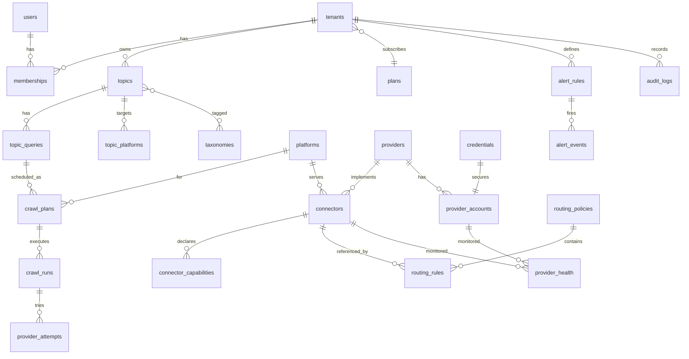

# DATA MODEL

Konvensi:
- Primary key `uuid` memakai **UUIDv7** (terurut waktu) yang digenerate aplikasi (`Bun.randomUUIDv7()` — verifikasi di spike).
- Semua timestamp `timestamptz` UTC. Tampilan di-convert ke timezone tenant (default `Asia/Jakarta`).
- Soft delete: `deleted_at timestamptz NULL` untuk entitas yang bisa di-restore.
- Tabel ber-`tenant_id` → RLS aktif (lihat ARCHITECTURE §8). Implementasi: `packages/db/migrations/0007_rls_grants.up.sql` — role grup `smip_app` (NOBYPASSRLS, API), `smip_system` (BYPASSRLS, worker/operator), `smip_py_reader` (SELECT credential saja); fungsi `smip_current_tenant()`.
- **DDL sumber kebenaran = migrasi SQL** `packages/db/migrations/NNNN_*.{up,down}.sql` (`bun run db:migrate up|down|status`). Dokumen ini adalah spesifikasi; bila berbeda, migrasi + test yang menang dan dokumen diperbarui.
- Nama enum Postgres diawali `e_`.

---

## 1. ERD (PostgreSQL)



---

## 2. PostgreSQL — Identity & Tenancy

### 2.1 `plans`
| Kolom | Tipe | Constraint | Keterangan |
|---|---|---|---|
| id | uuid | PK | |
| code | text | UNIQUE NOT NULL | `starter`, `pro`, `enterprise` |
| name | text | NOT NULL | |
| limits | jsonb | NOT NULL | `{ "max_topics": 50, "min_interval_sec": 900, "monthly_fetch_budget_units": 100000, "retention_days": 365, "max_users": 20 }` — angka contoh, ditetapkan bisnis |
| created_at | timestamptz | NOT NULL default now() | |

### 2.2 `tenants`
| Kolom | Tipe | Constraint | Keterangan |
|---|---|---|---|
| id | uuid | PK | |
| slug | citext | UNIQUE NOT NULL | |
| name | text | NOT NULL | |
| status | e_tenant_status | NOT NULL default 'active' | `active`, `suspended`, `closed` |
| plan_id | uuid | FK plans(id) | |
| timezone | text | NOT NULL default 'Asia/Jakarta' | |
| settings | jsonb | NOT NULL default '{}' | override limit, fitur |
| created_at, updated_at | timestamptz | | |
| deleted_at | timestamptz | NULL | |

### 2.3 `users`
| Kolom | Tipe | Constraint | Keterangan |
|---|---|---|---|
| id | uuid | PK | |
| email | citext | UNIQUE NOT NULL | |
| name | text | NOT NULL | |
| password_hash | text | NULL | argon2id (`Bun.password`), NULL jika SSO |
| mfa_secret_enc | bytea | NULL | terenkripsi envelope |
| is_platform_operator | boolean | NOT NULL default false | superadmin global |
| status | e_user_status | NOT NULL default 'active' | `active`, `disabled`, `invited` |
| last_login_at | timestamptz | NULL | |
| created_at, updated_at | timestamptz | | |

### 2.4 `memberships`
| Kolom | Tipe | Constraint |
|---|---|---|
| tenant_id | uuid | FK tenants, PK(tenant_id, user_id) |
| user_id | uuid | FK users |
| role | e_role | `owner`, `admin`, `analyst`, `viewer` |
| created_at | timestamptz | |

### 2.5 `refresh_tokens`
| Kolom | Tipe | Keterangan |
|---|---|---|
| id | uuid PK | |
| user_id | uuid FK | |
| token_hash | bytea UNIQUE | SHA-256 dari token; token asli tidak disimpan |
| family_id | uuid | rotasi; reuse terdeteksi → revoke seluruh family |
| tenant_id | uuid NULL FK tenants | tenant yang dipilih saat login — access token hasil refresh butuh `tid` (migrasi 0008) |
| expires_at, revoked_at, created_at | timestamptz | |
| ip | inet, user_agent text | |

### 2.6 `api_keys`
| Kolom | Tipe | Keterangan |
|---|---|---|
| id | uuid PK | |
| tenant_id | uuid FK | RLS |
| name | text | |
| prefix | text UNIQUE | 8 karakter pertama untuk identifikasi |
| key_hash | bytea | SHA-256(secret) |
| scopes | text[] | `analytics:read`, `topics:write`, … |
| expires_at, last_used_at, revoked_at, created_at | timestamptz | |

---

## 3. PostgreSQL — Topic & Scheduling

### 3.1 `platforms` (registry, global)
| Kolom | Tipe | Keterangan |
|---|---|---|
| code | text PK | `x`, `instagram`, `facebook`, `threads`, `tiktok`, `youtube`, `bluesky`, `reddit` |
| name | text | label UI |
| icon | text | nama ikon UI |
| content_types | text[] | mis. `{post,reply,repost,quote}` |
| enabled | boolean | |
| sort_order | int | |

### 3.2 `taxonomies`
| id uuid PK | tenant_id uuid NULL (NULL = global) | type e_taxonomy_type (`interest`,`industry`) | name text | UNIQUE(tenant_id, type, lower(name)) |

### 3.3 `topics`
| Kolom | Tipe | Constraint | Keterangan |
|---|---|---|---|
| id | uuid | PK | |
| tenant_id | uuid | FK, RLS | |
| name | text | NOT NULL, UNIQUE(tenant_id, lower(name)) WHERE deleted_at IS NULL | |
| description | text | NULL | |
| author_user_id | uuid | FK users | |
| status | e_topic_status | `active`,`paused`,`archived` | |
| filter_ads | boolean | default false | |
| language_hints | text[] | default `{id}` | |
| default_interval_sec | int | CHECK in (300,900,1800,2700,3600) | 5m/15m/30m/45m/1h — samakan dengan UI produk (screenshot) |
| kind | text | NOT NULL default 'topic' CHECK in ('topic','account') | migrasi 0024 — `account` = pantau akun (query `@username`, operation user_timeline) |
| version | int | NOT NULL default 1 | optimistic locking `If-Match` (API_SPEC §1.3); naik di setiap PATCH/pause/resume/archive — migrasi 0011 |
| created_at, updated_at, deleted_at | timestamptz | | |

Index: `(tenant_id, status)`, trigram GIN pada `name` untuk search.

### 3.4 `topic_taxonomies`
`topic_id uuid FK`, `taxonomy_id uuid FK`, PK(topic_id, taxonomy_id), `tenant_id` (RLS).

### 3.5 `topic_queries`
| Kolom | Tipe | Keterangan |
|---|---|---|
| id | uuid PK | |
| tenant_id | uuid | RLS |
| topic_id | uuid FK topics ON DELETE CASCADE | |
| kind | e_query_kind | `main`, `sub` |
| label | text NULL | |
| query_text | text NOT NULL | input user boolean, mis. `"DEMO" OR "UNRAS"` |
| query_ast | jsonb NOT NULL | hasil parser (lihat §3.8) |
| ast_hash | bytea | SHA-256 AST ter-normalisasi — deteksi query identik (dedup planner collection stream, ADR-009 near-term) |
| keywords | text[] NULL | keyword sederhana (bukan boolean) — di-OR-kan ke AST oleh compiler (lihat CONNECTOR_SPEC §5). Sesuai tab "Query Lists" produk (screenshot 12). |
| media_tags | text[] NULL | item hanya match bila mengandung salah satu tag/label media ini (local matcher). NULL = tidak memfilter. |
| not_media_tags | text[] NULL | item ditolak bila mengandung salah satu tag/label media ini (local matcher). |
| languages | text[] NULL | bahasa yang diterima per query: `id`,`en`,`ms`. NULL = ikut `topics.language_hints`. |
| platforms | text[] NULL | NULL = semua platform topik |
| enabled | boolean | |
| created_at, updated_at | timestamptz | |

> **Catatan makna `media_tags`/`not_media_tags`:** di produk referensi ("Media Tags"/"Not Media Tags") maknanya belum 100% pasti (bisa berarti tag/label pada media, atau tipe media). Definisi di atas (tag/label konten pada item) adalah interpretasi awal dan **wajib diverifikasi** terhadap produk saat implementasi (catat di PROVIDER_MATRIX/ADR bila berubah). `languages` topik-level default `{id}` tapi mendukung `en` dan `ms` (Malaysia) sesuai screenshot 12.

### 3.6 `topic_platforms`
| topic_id uuid | platform_code text FK platforms | tenant_id uuid | enabled boolean | interval_sec int NULL (NULL = default topik) | operations text[] default `{search_keyword}` | PK(topic_id, platform_code) |

### 3.7 `crawl_plans`
Satu baris per (topic_query × platform × operation). Dibuat/diupdate otomatis oleh use-case `SyncCrawlPlans` saat topik berubah.

| Kolom | Tipe | Keterangan |
|---|---|---|
| id | uuid PK | |
| tenant_id | uuid | RLS (scheduler memakai role system) |
| topic_id | uuid FK | |
| topic_query_id | uuid FK | |
| platform_code | text FK | |
| operation | text | |
| interval_sec | int | efektif setelah clamp plan & capability |
| status | e_plan_status | `active`,`paused`,`error_backoff`,`disabled` |
| next_run_at | timestamptz | |
| last_run_at | timestamptz NULL | |
| high_watermark | timestamptz NULL | published_at terbaru yang sudah diingest — **hanya maju pada run `succeeded`** (CONNECTOR_SPEC §7) |
| gap_windows | jsonb default '[]' | celah dari run `partial`: `[{"since":…,"until":…,"created_at":…}]`, diambil ulang sebelum dibuang (`max_gap_age`) |
| cursor_state | jsonb | state spesifik operation (opaque, dipegang router) |
| inflight_run_id | uuid NULL | coalescing: jika non-null dan run belum final → skip |
| consecutive_failures | int default 0 | |
| priority | smallint | 0=realtime (≤15m), 5=normal, 9=backfill |
| created_at, updated_at | timestamptz | |

UNIQUE(topic_query_id, platform_code, operation). Index: `(status, next_run_at) WHERE status='active'`.

### 3.8 Format `query_ast`
```json
{
  "type": "or",
  "children": [
    { "type": "phrase", "value": "demo dpr" },
    { "type": "term", "value": "demo" },
    { "type": "and", "children": [
      { "type": "phrase", "value": "27 agustus" },
      { "type": "not", "child": { "type": "term", "value": "2025" } }
    ]}
  ],
  "version": 1
}
```

### 3.9 `crawl_runs` (partitioned by RANGE `scheduled_for`, bulanan)
| Kolom | Tipe | Keterangan |
|---|---|---|
| id | uuid | PK(id, scheduled_for) |
| tenant_id | uuid NULL | NULL untuk run **collection stream** lintas tenant (system-owned, ADR-009) |
| crawl_plan_id | uuid NULL | NULL bila run milik stream |
| collection_stream_id | uuid NULL | diisi bila run milik stream; CHECK tepat satu dari `crawl_plan_id`/`collection_stream_id` terisi |
| scheduled_for | timestamptz | |
| kind | e_run_kind | `incremental`, `backfill`, `engagement_refresh`, `verify` — `engagement_refresh` boleh tanpa plan/stream/tenant (migrasi 0020) dengan `refresh_target jsonb` `{platform, post_ids[]}` |
| status | e_run_status | `queued`,`dispatching`,`fetching`,`processing`,`succeeded`,`partial`,`failed`,`skipped`,`cancelled` |
| window_from, window_to | timestamptz | |
| started_at, finished_at | timestamptz NULL | |
| attempts | smallint | |
| items_fetched, items_matched, items_new | int | |
| final_connector_id | uuid NULL | connector yang akhirnya sukses |
| error_code | text NULL | dari taksonomi ConnectorError |
| error_message | text NULL | sudah di-redact |
| trace_id | text | |

Index: `(crawl_plan_id, scheduled_for DESC)`, `(status) WHERE status IN ('queued','dispatching','fetching','processing')`.

> **Kolom tambahan (migrasi 0013–0014, I-13/I-14).** `routing jsonb` — state routing per run (policy, connector/akun terpilih, reservasi, exclude hasil failover, retry, recompile); `pending_batches int` — pesan hilir yang belum selesai; `min_published_at`/`max_published_at` — rentang item diterima (celah run partial & kandidat high-watermark). Run ditutup `succeeded`/`partial` oleh `finalizeRunIfDone` saat `status='processing'` **dan** `pending_batches = 0` (lihat QUEUE_SPEC §5).
>
> **Presisi waktu.** `timestamptz` bermikrodetik, `Date` JS bermilidetik → pembanding `scheduled_for` (kunci partisi) dikirim balik sebagai teks asli (`scheduled_for::text`), bukan dari `Date` (bug ditemukan I-14).

> **FK ke tabel partisi.** PK `crawl_runs` = `(id, scheduled_for)`. Postgres **mewajibkan** kolom partisi (`scheduled_for`) ikut di setiap FK yang menunjuk tabel terpartisi. Maka tabel anak (`provider_attempts`) menyimpan **`crawl_run_id` + `crawl_run_scheduled_for`** dan FK-nya `(crawl_run_id, crawl_run_scheduled_for) → crawl_runs(id, scheduled_for)`. Alternatif: tanpa FK deklaratif, integritas dijaga di app + `ON DELETE` manual saat drop partition. Pilih salah satu secara konsisten (lihat ADR-002).
>
> **Reaper `inflight_run_id`.** Bila worker mati setelah scheduler set `crawl_plans.inflight_run_id` tapi sebelum run final, plan akan ter-*coalesce* selamanya. Job `crawl.reaper` (worker-ops, tiap 60 s) mencari `crawl_runs` yang masih di status non-final melewati `scheduled_for + deadline_grace` → set `status='failed'`, `error_code='STUCK_RUN'`, dan **reset `crawl_plans.inflight_run_id = NULL`** dengan compare-and-set. (Lihat QUEUE_SPEC §6 & RUNBOOK.)

### 3.10 `provider_attempts` (partitioned bulanan)
| id uuid | crawl_run_id uuid | crawl_run_scheduled_for timestamptz | tenant_id uuid | connector_id uuid | provider_account_id uuid | attempt_no smallint | started_at timestamptz | duration_ms int | outcome e_attempt_outcome (`success`,`retryable_error`,`failover_error`,`fatal_error`) | error_code text | http_status smallint | items int | usage jsonb (`{"requests":1,"results":50,"cost_units":0.0}`) | raw_ref text |

FK `(crawl_run_id, crawl_run_scheduled_for) → crawl_runs(id, scheduled_for)` (lihat catatan FK di §3.9).

### 3.11 `collection_streams` & `stream_topic_links` (dedup fetch — ARCHITECTURE §12, near-term)

Additive di atas `crawl_plans`: dedup planner menggabung query beririsan jadi stream minimal, fetch sekali, matcher memetakan ke banyak topic. Kalau planner off → fallback ke crawl per-query.

**`collection_streams`** (global, lintas tenant karena `posts` global)
| Kolom | Tipe | Keterangan |
|---|---|---|
| id | uuid PK | |
| platform_code | text FK | |
| operation | text | |
| stream_key | bytea UNIQUE | hash dari (platform, operation, interval_class, himpunan term ter-normalisasi, visibility) |
| interval_class | int | 300/900/1800/2700/3600 — stream **dikelompokkan per kelas interval** agar topic 1 jam tidak ikut ditarik tiap 5 menit hanya karena berbagi term dengan topic 5m |
| visibility_tenant_id | uuid NULL | NULL = shared (akun shared pool, lintas tenant); terisi = stream privat tenant tsb (akun BYO — tidak boleh melayani tenant lain, R-13/R-15) |
| terms | text[] | himpunan term positif gabungan (untuk fetch/recall) |
| query_native | jsonb | compiled query per connector (cache) |
| interval_sec | int | = `interval_class` (clamp capability); tidak lagi "min dari semua anggota" |
| cursor_state | jsonb | high-watermark per stream |
| inflight_run_id | uuid NULL | coalescing (sama pola crawl_plans) |
| next_run_at, last_run_at | timestamptz | |
| enabled | boolean | |

**`stream_topic_links`**
| stream_id uuid FK | tenant_id uuid | topic_query_id uuid FK | PK(stream_id, topic_query_id) | — RLS via tenant_id |

> **Implementasi (I-22):** migrasi 0017 menambah `consecutive_failures`, `priority`, `updated_at` + index due; watermark stream memakai kolom `high_watermark`/`gap_windows` (sama pola `crawl_plans`), `cursor_state` belum dipakai. Detail: ADR-009 § Implementasi.

**Atribusi biaya stream.** Run stream bersifat system-owned (`crawl_runs.tenant_id = NULL`). Biaya `usage` per run dialokasikan ke tenant anggota **proporsional jumlah post yang match topic tenant tsb** di run itu (sisa yang tidak match siapa pun → dibagi rata ke tenant anggota stream). Alokasi ditulis ke `quota_usage` tenant (scope `tenant`) oleh worker-sink, sehingga cost guard per tenant (COST_MODEL §8) tetap bekerja. Tabel `cost_allocations(run_id, tenant_id, cost_units, basis)` menyimpan jejaknya untuk audit/tagihan.

Recall dari stream, **presisi tetap dari local matcher atas AST asli** (ADR-006). Post yang tak match topic mana pun tetap disimpan untuk backfill (§9). Kunci berbagi `ast_hash` (§3.5). Detail: ADR-009.

---

## 4. PostgreSQL — Provider Management

### 4.1 `providers`
| Kolom | Tipe | Keterangan |
|---|---|---|
| id | uuid PK | |
| key | text UNIQUE | `twitterapi_io`, `apify`, `youtube_data_api`, `meta_graph`, `threads_api`, `x_api`, `instagrapi`, `fake` |
| name | text | |
| kind | e_provider_kind | `official`, `third_party`, `unofficial` |
| risk_level | e_risk | `low`,`medium`,`high` (unofficial = high by default) |
| enabled | boolean | master switch |
| docs_url, tos_url, pricing_url | text | sumber fakta |
| notes | text | |
| created_at, updated_at | timestamptz | |

### 4.2 `connectors`
| Kolom | Tipe | Keterangan |
|---|---|---|
| id | uuid PK | |
| key | text UNIQUE | `<provider>.<platform>[.<varian>]` — mis. `twitterapi_io.x`, `apify.x.xquik`, `apify.instagram.boolean_search`, `apify.instagram.keyword_crawlerbros`, `apify.facebook.search_scraper_one`, `youtube_data_api.youtube`, `x_api.x`. Satu provider (Apify) bisa punya banyak connector per platform — varian = actor |
| provider_id | uuid FK | |
| platform_code | text FK | |
| runtime | e_runtime | `bun`, `python` |
| version | text | semver dari manifest |
| enabled | boolean | |
| config | jsonb | config non-rahasia yg divalidasi `config_schema` (mis. `actor_id`, `input_template`) |
| config_schema | jsonb | JSON Schema dari manifest |
| manifest_hash | text | untuk deteksi perubahan manifest |
| created_at, updated_at | timestamptz | |

### 4.3 `connector_capabilities`
| Kolom | Tipe | Keterangan |
|---|---|---|
| connector_id | uuid FK | PK(connector_id, operation) |
| operation | text | |
| declared | jsonb | dari manifest: `{ "query_features": ["phrase","or"], "supports_since": true, "supports_cursor": true, "max_query_length": null, "returns": ["metrics.likes","author.created_at"] }` |
| measured | jsonb | hasil verify/observasi: `{ "p50_latency_ms":..., "p95_latency_ms":..., "min_interval_sec": ..., "sample_size": ... }` |
| status | e_verify_status | `declared`, `verified`, `failed`, `deprecated` |
| verified_at | timestamptz NULL | |
| evidence_ref | text | link laporan contract test / CI run |

> `min_interval_sec` **diukur**, bukan dikarang: default = `ceil(p95_latency_ms × 2 / 1000)` dibulatkan ke interval yang didukung, atau ditetapkan operator dengan catatan sumber.

### 4.4 `credentials`
| Kolom | Tipe | Keterangan |
|---|---|---|
| id | uuid PK | |
| tenant_id | uuid NULL | NULL = milik operator |
| kind | e_cred_kind | `api_key`, `oauth2`, `session`, `basic`, `cookie_jar` |
| ciphertext | bytea | AES-256-GCM(payload JSON) |
| iv | bytea | 12 byte |
| wrapped_dek | bytea | DEK dibungkus KEK di KMS |
| kek_id | text | id/versi KEK |
| aad | text | `credential:{id}:{tenant_id}` — additional authenticated data |
| fingerprint | bytea | HMAC-SHA256(secret, pepper) — deteksi duplikat tanpa dekripsi |
| expires_at | timestamptz NULL | |
| rotated_at, created_at | timestamptz | |
| created_by | uuid | |

Tidak ada API yang pernah me-*return* kolom ini selain metadata (`id`, `kind`, `expires_at`, `last4` yang disimpan terpisah di `display_hint`).

### 4.5 `provider_accounts`
| Kolom | Tipe | Keterangan |
|---|---|---|
| id | uuid PK | |
| tenant_id | uuid NULL | NULL = shared pool |
| provider_id | uuid FK | |
| label | text | |
| credential_id | uuid FK credentials UNIQUE | |
| display_hint | text | mis. `••••a91f` |
| status | e_account_status | `active`,`disabled`,`cooling_down`,`needs_attention`,`revoked` |
| cooldown_until | timestamptz NULL | |
| attention_reason | text NULL | mis. `CHALLENGE_REQUIRED` |
| allowed_connector_ids | uuid[] NULL | NULL = semua connector provider tsb |
| last_used_at | timestamptz | |
| created_at, updated_at | timestamptz | |

### 4.6 `routing_policies`
| Kolom | Tipe | Keterangan |
|---|---|---|
| id | uuid PK | |
| tenant_id | uuid NULL | NULL = default global; tenant override jika ada |
| platform_code | text | |
| operation | text | |
| strategy | e_strategy | `priority_weighted` (default), `round_robin`, `cost_aware` |
| failover_enabled | boolean | |
| max_attempts | smallint | total percobaan lintas connector per run |
| allow_unverified | boolean default false | override eksplisit (audit) |
| enabled | boolean | |
| version | int | optimistic locking |
| updated_by, updated_at | | |

UNIQUE(COALESCE(tenant_id,'00000000-0000-0000-0000-000000000000'), platform_code, operation).

### 4.7 `routing_rules`
| Kolom | Tipe | Keterangan |
|---|---|---|
| id | uuid PK | |
| policy_id | uuid FK ON DELETE CASCADE | |
| connector_id | uuid FK | |
| priority | smallint | 1 = paling utama |
| weight | int CHECK (weight BETWEEN 0 AND 1000) | 0 = standby (hanya failover) |
| enabled | boolean | |
| max_share_pct | smallint NULL | batas % traffic dalam window 1 jam |
| conditions | jsonb | mis. `{ "run_kinds": ["backfill"] }` |
| UNIQUE(policy_id, connector_id) | | |

### 4.8 `rate_limit_policies`
| Kolom | Tipe | Keterangan |
|---|---|---|
| id | uuid PK | |
| scope_type | e_scope | `provider`, `connector`, `provider_account` |
| scope_id | uuid | |
| algorithm | e_rl_algo | `token_bucket`, `fixed_window`, `concurrency` |
| capacity | int | ukuran bucket / max concurrent |
| refill_tokens | int | |
| refill_interval_ms | int | |
| source | e_fact_source | `provider_docs`, `provider_header`, `observed`, `internal_safety` |
| source_ref | text | URL dokumen / catatan observasi |
| verified_at | timestamptz NULL | |
| enabled | boolean | |

Jika provider mengembalikan header rate limit / `Retry-After`, connector melaporkannya → router menghormati nilai **aktual** (dynamic override di Redis) di atas policy statis.

### 4.9 `quota_policies`
| id uuid | scope_type (`global`,`tenant`,`topic`,`provider`,`connector`,`provider_account` — global/topic untuk cost guard COST_MODEL §8) | scope_id uuid (NULL hanya untuk global) | period e_period (`day`,`month`) | unit e_unit (`requests`,`results`,`cost_units`) | limit_value numeric | hard boolean | alert_thresholds smallint[] default `{50,80,95}` | reset_tz text default 'UTC' | enabled | throttled_since timestamptz NULL |

> Migrasi 0019 (I-23): `throttled_since` diisi scheduler saat soft quota (`hard=false`) mencapai limit (cost guard → throttle interval, bukan stop) dan dikosongkan saat dilepas; transisi menulis outbox `cost_guard.throttled|released` (alert sekali).

### 4.10 `quota_usage`
| scope_type | scope_id | period e_period | period_start date | unit | used numeric | reserved numeric | updated_at | PK(scope_type, scope_id, period, period_start, unit) |

> Migrasi 0010 (I-09): `period` masuk PK — tanpa itu quota harian & bulanan unit yang sama bertabrakan tiap tanggal 1. Redis adalah sumber kebenaran live (Lua atomic); tabel ini diisi flush berkala worker-ops + dipakai men-seed ulang Redis bila kunci hilang.

Sumber kebenaran real-time di Redis; di-flush ke tabel ini tiap 60 s oleh `worker-ops` dan saat period rollover.

### 4.11 `provider_health`
| Kolom | Tipe | Keterangan |
|---|---|---|
| connector_id | uuid | PK(connector_id, provider_account_key) |
| provider_account_key | uuid | `00000000…` jika level connector |
| state | e_health | `healthy`,`degraded`,`unhealthy`,`unknown` |
| circuit | e_circuit | `closed`,`open`,`half_open` |
| score | smallint | 0–100 |
| success_rate_5m | real | |
| p95_latency_ms | int | |
| last_success_at, last_failure_at | timestamptz | |
| last_error_code | text | |
| opened_at, next_probe_at | timestamptz NULL | |
| updated_at | timestamptz | |

### 4.12 `health_checks` (partitioned bulanan)
`id, connector_id, provider_account_id, kind (active|passive_window), at, ok, latency_ms, error_code, details jsonb`

### 4.13 `outbox`
`id bigserial PK, aggregate text, aggregate_id uuid, event_type text, payload jsonb, created_at, published_at NULL` — index `WHERE published_at IS NULL`.

---

## 5. PostgreSQL — AI, Alert, Export, Audit, Geo

### 5.1 `model_versions`
`id, task (sentiment|emotion|gender|age_range|keyphrase|lang|geo|llm_fallback), name, version, artifact_uri, config jsonb, metrics jsonb (macro_f1, per_class, eval_set_id, coverage), status (candidate|active|retired), activated_at, activated_by`

`emotion` = klasifikasi 8 emosi Plutchik (AI_SPEC). `gender`/`age_range` = inferensi demografi per akun (AI_SPEC §12) — metode & lisensi terdokumentasi, hanya dipakai untuk agregat.

### 5.2 `sentiment_overrides`
`id, tenant_id, topic_id, platform, post_id text, previous_label, new_label, previous_model_version, user_id, reason text, created_at` — sumber `topic_match_events` sign -1/+1 dan dataset training.

### 5.3 `eval_sets` & `eval_items`
`eval_sets(id, name, task, created_at)`; `eval_items(id, eval_set_id, text, label, annotator_ids uuid[], agreement real, source_post_ref)`.

### 5.4 `alert_rules`
`id, tenant_id, topic_id NULL, type (volume_spike|negative_ratio|new_issue|provider_unhealthy|quota_threshold), params jsonb, channels uuid[], cooldown_sec, enabled, created_by, created_at`

### 5.5 `alert_events`
`id, tenant_id, rule_id, fired_at, payload jsonb, status (open|acked|resolved), acked_by, resolved_at`

### 5.6 `notification_channels`
`id, tenant_id, kind (email|webhook|telegram), config jsonb (non-rahasia), credential_id NULL, enabled`

### 5.7 `exports`
`id, tenant_id, requested_by, kind (csv|xlsx), params jsonb, status (queued|running|done|failed|expired), file_uri, row_count, expires_at, created_at`

### 5.8 `audit_logs` (partitioned bulanan, append-only: REVOKE UPDATE, DELETE)
`id, tenant_id NULL, actor_type (user|api_key|system), actor_id, action (e.g. routing_rule.update), target_type, target_id, before jsonb (redacted), after jsonb (redacted), ip inet, user_agent, request_id, at`

### 5.9 `geo_regions` (gazetteer)
`code text PK (kode wilayah Kemendagri/BPS), level (province|regency), name, parent_code, aliases text[], centroid point NULL` — sumber data & lisensi dicatat di `docs/adr/` sebelum dipakai.

### 5.10 `nlp_labels` (korpus training — partitioned bulanan, append-only)
Setiap inferensi NLP (sentiment/emotion/gender/age/keyphrase) **ditulis ke sini** sebagai korpus training untuk self-host fase lanjut (AI_SPEC, COST_MODEL §7). Data training **tidak bisa dibuat surut** — inferensi yang tak tercatat hilang selamanya.

| Kolom | Tipe | Keterangan |
|---|---|---|
| id | uuid | PK(id, created_at) |
| platform | text | |
| post_id | text | **tanpa FK ke posts** — post kena retensi (§9), label harus tetap hidup |
| task | text | `sentiment`,`emotion`,`gender`,`age_range`,`keyphrase`,`lang` |
| text_ref | text | pointer ke `s3://smip-training/{platform}/{yyyy}/{mm}/{post_id}.txt` — bucket **khusus training**, BUKAN raw (`smip-raw/` lifecycle 30 hari → teks hilang, korpus tak berguna). Teks di-pseudonimkan (mention → `<user>`, AI_SPEC §2) sebelum ditulis. |
| label | text | hasil (mis. `negative`, `anger`, `male`, `22_30`) |
| confidence | real | |
| source | text | `model`,`llm`,`human` |
| model_version | text | |
| created_at | timestamptz | |

Index `(model_version, created_at)` untuk ekspor training. Karena korpus berisi data pribadi (teks publik), retensi & dasar pemrosesan training ditetapkan di memo S-15/S-23 (UU PDP); `below_18` tidak pernah ditulis sebagai label per akun (§6.6). Ini akan jadi **tabel terbesar di Postgres** (~volume post/bulan) → partisi bulanan wajib. Ekspor massal → fine-tune IndoBERT (AI_SPEC).

---

## 6. ClickHouse

Engine & angka TTL di bawah adalah **rancangan awal**; semua DDL diuji di spike (versi ClickHouse dipin).

### 6.1 `posts` — konten global
```sql
CREATE TABLE posts (
  platform            LowCardinality(String),
  post_id             String,
  content_type        LowCardinality(String),   -- post|reply|repost|quote|comment
  parent_post_id      Nullable(String),
  root_post_id        Nullable(String),
  parent_author_id    Nullable(String),         -- penulis asli untuk repost/quote → "Most Reposted Accounts"
  parent_author_handle Nullable(String),
  url                 Nullable(String),
  text                String,
  lang                LowCardinality(String),
  published_at        DateTime64(3, 'UTC'),
  author_id           String,
  author_handle       String,
  author_name         Nullable(String),
  author_created_at   Nullable(DateTime('UTC')),
  author_followers    Nullable(UInt64),
  author_verified     Nullable(UInt8),
  author_location_raw Nullable(String),
  hashtags            Array(String),
  mentions            Array(String),
  media               String,                   -- JSON string
  geo_region_code     Nullable(String),
  geo_confidence      Nullable(Float32),
  is_ad               Nullable(UInt8),
  source_connector    LowCardinality(String),
  raw_ref             String,
  ingested_at         DateTime64(3, 'UTC'),
  version             UInt64                    -- epoch ms, ReplacingMergeTree
) ENGINE = ReplacingMergeTree(version)
PARTITION BY toYYYYMM(published_at)
ORDER BY (platform, post_id);
```

### 6.2 `topic_match_events` — stream append-only ber-sign (sumber MV)
```sql
CREATE TABLE topic_match_events (
  tenant_id        UUID,
  topic_id         UUID,
  topic_query_id   UUID,
  platform         LowCardinality(String),
  post_id          String,
  content_type     LowCardinality(String),
  published_at     DateTime64(3, 'UTC'),
  author_id        String,
  author_handle    String,
  author_created_year Nullable(UInt16),
  author_followers Nullable(UInt64),   -- untuk agg_author_1d (anyLast)
  sentiment        Enum8('negative' = -1, 'neutral' = 0, 'positive' = 1),
  sentiment_score  Float32,
  emotion          Enum8('anger'=1,'anticipation'=2,'disgust'=3,'trust'=4,'joy'=5,'sadness'=6,'surprise'=7,'fear'=8,'unknown'=0),
  emotion_score    Float32,
  author_gender    Enum8('unknown'=0,'male'=1,'female'=2),
  author_gender_conf Float32,
  author_age_range Enum8('unknown'=0,'below_18'=1,'18_21'=2,'22_30'=3,'31_45'=4,'46_55'=5,'above_55'=6),
  author_age_conf  Float32,
  model_version    LowCardinality(String),
  issues           Array(String),
  hashtags         Array(String),
  parent_author_id Nullable(String),
  parent_author_handle Nullable(String),
  geo_region_code  Nullable(String),
  media            Array(Tuple(type LowCardinality(String), url String, thumb Nullable(String))),  -- sumber MV media_items (MV tidak bisa join ke posts)
  engagement       UInt64,          -- total engagement yang diketahui saat insert (null → 0 + flag)
  engagement_known UInt8,
  sign             Int8,            -- +1 insert, -1 pembatalan (override/reprocess)
  event_at         DateTime64(3, 'UTC')
) ENGINE = MergeTree
PARTITION BY toYYYYMM(published_at)
ORDER BY (tenant_id, topic_id, published_at, platform, post_id)
SETTINGS non_replicated_deduplication_window = 1000;   -- WAJIB agar insert_deduplication_token berlaku (S-07); Replicated* tidak perlu
```
worker-sink selalu insert dengan `sinkInsertSettings(batch_id)` (`packages/analytics/src/insert.ts`): `insert_deduplication_token = batch_id`, **`deduplicate_blocks_in_dependent_materialized_views = 1`**, `async_insert = 0`. **Setiap tabel target MV** (semua `agg_*`, `topic_matches`, `media_items`) juga wajib `SETTINGS non_replicated_deduplication_window` — tanpa keduanya, tabel sumber ter-dedup tetapi **MV tetap menerima blok → agregat dobel** (ditemukan F-05, 2026-09-28; dijaga test penjaga). DDL sumber kebenaran: `packages/analytics/migrations/`.

Override sentiment/emotion: insert baris lama dengan `sign=-1` + baris baru `sign=+1` → semua agregat (yang memakai `sum(sign)`) otomatis konsisten tanpa update.

> **Idempotensi lintas batch (bukan hanya Redis).** Dedupe konten pakai `seen*` di Redis (§7), tapi karena `topic_match_events` append-only dan agg dibaca **langsung** darinya, kehilangan key Redis bisa menyebabkan **double-count**. Karena itu: (1) Redis dedupe dipisah dari Redis queue (§7 & DEPLOYMENT §4.1); (2) worker-sink menambahkan **guard sisi ClickHouse**: sebelum insert `sign=+1`, cek `topic_matches` (state ReplacingMergeTree §6.3) untuk `(tenant,topic,platform,post_id)` yang sudah `sign=1` dengan `model_version` sama → skip. Guard ini membuat kebenaran agg tidak 100% bergantung pada TTL Redis.
>
> **Guard ini tidak atomik** (cek lalu insert). Dua sink paralel untuk post yang sama bisa sama-sama lolos. Mitigasi: consumer `sink.analytics` dipartisi per `hash(tenant_id, topic_id, post_id) mod N` (satu consumer per partisi — lihat QUEUE_SPEC §3) + `insert_deduplication_token` per batch. Residual risk (retry setelah crash di tengah batch) diterima dan dideteksi job rekonsiliasi harian (`count` events sign vs `topic_matches FINAL`).

### 6.3 `topic_matches` — state terkini untuk feed/list
`ReplacingMergeTree(event_at)` ORDER BY `(tenant_id, topic_id, published_at, platform, post_id)`, kolom sama dengan 6.2 tanpa `sign`, diisi MV dari `topic_match_events WHERE sign = 1`. `published_at` aman masuk kunci dedup karena tidak pernah berubah untuk satu post, dan membuat filter waktu feed memangkas granule. Query feed memakai `FINAL` + `LIMIT` + filter waktu. **Diukur di S-07** (2,1 juta baris, 2 vCPU, window 7 hari, LIMIT 50): ORDER BY v0.3 tanpa `published_at` → FINAL p50 72 ms; dengan `published_at` → p50 18 ms (tanpa FINAL 13 ms); hasil dedup identik. Evidence: `docs/evidence/S-07/`.

### 6.4 `engagement_snapshots`
```sql
CREATE TABLE engagement_snapshots (
  platform LowCardinality(String), post_id String, captured_at DateTime64(3,'UTC'),
  likes Nullable(UInt64), comments Nullable(UInt64), shares Nullable(UInt64),
  views Nullable(UInt64), quotes Nullable(UInt64), saves Nullable(UInt64),
  source_connector LowCardinality(String)
) ENGINE = MergeTree PARTITION BY toYYYYMM(captured_at)
ORDER BY (platform, post_id, captured_at) TTL toDateTime(captured_at) + INTERVAL 180 DAY;
```

### 6.5 Tabel agregat (dibaca dashboard)
| Tabel | Engine | Kunci | Isi | Sumber | TTL |
|---|---|---|---|---|---|
| `agg_topic_5m` | SummingMergeTree | tenant, topic, platform, sentiment, content_type, bucket(5m) | `posts=sum(sign)`, `engagement=sum(sign*engagement)`, `engagement_known_posts=sum(sign*engagement_known)` | MV topic_match_events | 35 hari |
| `agg_topic_1h` | SummingMergeTree | sama, bucket(1h) | sama | MV | 400 hari |
| `agg_topic_1d` | SummingMergeTree | sama, bucket(1d) | sama | MV | tanpa TTL |
| `agg_topic_uniq_1h` | AggregatingMergeTree | tenant, topic, platform, bucket(1h) | `uniqState(author_id)` (hanya sign=1) | MV | 400 hari |
| `agg_issue_1h` | SummingMergeTree | tenant, topic, platform, **sentiment**, issue, bucket(1h) | `mentions=sum(sign)`, `engagement=sum(sign*engagement)` | MV + arrayJoin(issues) | 400 hari |
| `agg_author_1d` | **AggregatingMergeTree** | tenant, topic, platform, **sentiment**, author_id, day | `posts/replies/reposts/engagement` = `SimpleAggregateFunction(sum, Int64)`; `author_handle` = `SimpleAggregateFunction(anyLast, String)`; `author_followers` = `SimpleAggregateFunction(anyLast, Nullable(UInt64))` | MV | 400 hari |
| `agg_reposted_author_1d` | AggregatingMergeTree | tenant, topic, platform, parent_author_id, day | `reposted_count=SimpleAggregateFunction(sum, Int64)`, `parent_author_handle=SimpleAggregateFunction(anyLast, String)` | MV `WHERE content_type IN ('repost','quote') AND parent_author_id IS NOT NULL` | 400 hari |
| `agg_geo_1d` | SummingMergeTree | tenant, topic, platform, geo_region_code (**`''` = unknown**, bukan Nullable — kunci Nullable ditolak ClickHouse tanpa `allow_nullable_key`), day | `posts` | MV | tanpa TTL |
| `agg_author_age_1d` | AggregatingMergeTree | tenant, topic, day, author_created_year (0 = unknown) | `authors=uniqState(author_id)` (hanya sign=1) — **jumlah akun**, sesuai API `accounts/age` | MV | 400 hari |
| `agg_emotion_1h` | SummingMergeTree | tenant, topic, platform, emotion, bucket(1h) | `posts=sum(sign)`, `engagement=sum(sign*engagement)` | MV topic_match_events | 400 hari |
| `agg_emotion_1d` | SummingMergeTree | tenant, topic, platform, emotion, bucket(1d) | sama | MV | tanpa TTL |
| `agg_hashtag_1h` | SummingMergeTree | tenant, topic, platform, sentiment, hashtag, bucket(1h) | `mentions=sum(sign)`, `engagement=sum(sign*engagement)` | MV + `arrayJoin(hashtags)` | 400 hari |
| `agg_hashtag_1d` | SummingMergeTree | tenant, topic, platform, sentiment, hashtag, bucket(1d) | sama | MV | tanpa TTL |
| `agg_psycho_gender_1d` | SummingMergeTree | tenant, topic, platform, author_gender, sentiment, day | `posts=sum(sign)`; label dengan conf < τ **sudah dipetakan ke `unknown` oleh worker-ai sebelum sink** (MV tidak bisa membaca τ dari `model_versions`) agar `coverage_pct` bisa dihitung dari agregat | MV | 400 hari |
| `agg_psycho_age_1d` | SummingMergeTree | tenant, topic, platform, author_age_range, sentiment, day | `posts=sum(sign)`; conf < τ → `unknown` (sama) | MV | 400 hari |
| `provider_call_log` | MergeTree | connector, account, at | durasi, outcome, items, cost_units | worker fetch | 180 hari |

> **Limitasi `uniqState` (agg_topic_uniq_1h).** `uniqState(author_id)` **tidak bisa dikurangi** saat override/reprocess (`sign=-1`) atau penghapusan konten → hitungan akun unik bisa sedikit over-count setelah penghapusan. Ini limitasi yang diterima; koreksi via **rebuild periodik** partisi terdampak dari `topic_match_events WHERE sign=1` (job `retention`/`reprocess`). Sama untuk `agg_author_age_1d.authors`. `agg_reposted_author_1d`/`agg_hashtag_*` memakai `sum(sign)` (aman) — hanya widget berbasis `uniq` yang terpengaruh.
>
> **Jangan taruh kolom non-aditif di SummingMergeTree.** SummingMergeTree menjumlahkan **semua** kolom numerik non-key saat merge (mis. `author_followers` akan dijumlah). Kolom "nilai terakhir" wajib `SimpleAggregateFunction(anyLast, …)` di AggregatingMergeTree. Diuji di S-07.
>
> **Engagement tak diketahui.** `engagement` dijumlah dengan 0 untuk post tanpa metrik; `engagement_known_posts` memungkinkan UI menampilkan coverage engagement per platform (prinsip `null ≠ 0`).
>
> **Coverage psychography/emotion.** Widget gender/age/emotion **wajib** menampilkan `coverage_pct` = (post dengan label conf ≥ τ) / total, karena banyak akun `unknown`. Bucket `unknown` tidak disembunyikan diam-diam (SECURITY §9, AI_SPEC §12).

Contoh MV:
```sql
CREATE MATERIALIZED VIEW mv_agg_topic_1h TO agg_topic_1h AS
SELECT tenant_id, topic_id, platform, sentiment, content_type,
       toStartOfHour(published_at) AS bucket,
       sum(sign) AS posts,
       sum(sign * toInt64(engagement)) AS engagement,
       sum(sign * toInt64(engagement_known)) AS engagement_known_posts
FROM topic_match_events
GROUP BY tenant_id, topic_id, platform, sentiment, content_type, bucket;
```
Query dashboard selalu `sum(posts)` + `GROUP BY` (karena SummingMergeTree merge-nya eventual).

Catatan: "Exposure" pada screenshot = jumlah post per platform per bucket (bukan reach) kecuali provider menyediakan `views` terverifikasi. Definisi metrik dicatat di UI tooltip (ikon ⓘ).

### 6.6 `author_demographics` — inferensi demografi per akun (global, di-cache lintas tenant)
```sql
CREATE TABLE author_demographics (
  platform          LowCardinality(String),
  author_id         String,
  gender            Enum8('unknown'=0,'male'=1,'female'=2),
  gender_conf       Float32,
  age_range         Enum8('unknown'=0,'below_18'=1,'18_21'=2,'22_30'=3,'31_45'=4,'46_55'=5,'above_55'=6),
  age_conf          Float32,
  method            LowCardinality(String),   -- mis. name_lexicon | profile_signal | model_v2 (versioned)
  model_version     LowCardinality(String),
  updated_at        DateTime64(3,'UTC'),
  version           UInt64
) ENGINE = ReplacingMergeTree(version)
ORDER BY (platform, author_id);
```
- Diinferensi **per akun** (bukan per post), di-cache lintas tenant (pola `enr:` §7).
- **`below_18` tidak pernah disimpan per akun.** Menandai individu sebagai anak = memproses data anak (UU PDP). Bila inferensi menghasilkan `below_18`, tabel ini menyimpan `age_range='unknown'` + `method` bertanda `minor_suppressed`; bucket `below_18` hanya muncul di agregat melalui nilai yang didenormalisasi **langsung** ke `topic_match_events` saat sink (tidak di-cache per akun), dan hanya jika memo DPO (S-23) mengizinkan — default: digabung ke `unknown`. Saat sink, nilai `gender`/`age_range` + confidence **didenormalisasi** ke `topic_match_events` (seperti `author_created_year`).
- **Hanya dipakai untuk agregat.** Tidak pernah ditampilkan sebagai label individu di feed/post (SECURITY §9, AI_SPEC §12). Retensi & dasar hukum: §9 + ADR-007.

### 6.7 `media_items` — untuk halaman Gallery (Conversation)
```sql
CREATE TABLE media_items (
  tenant_id     UUID,
  topic_id      UUID,
  platform      LowCardinality(String),
  post_id       String,
  media_idx     UInt16,
  media_type    LowCardinality(String),     -- image|video|gif
  media_url     String,                     -- ditampilkan via image proxy internal (SECURITY §7)
  thumb_url     Nullable(String),
  published_at  DateTime64(3,'UTC'),
  sentiment     Enum8('negative'=-1,'neutral'=0,'positive'=1),
  sign          Int8,
  event_at      DateTime64(3,'UTC')
) ENGINE = MergeTree
PARTITION BY toYYYYMM(published_at)
ORDER BY (tenant_id, topic_id, published_at, platform, post_id, media_idx);
```
Diisi MV dari `topic_match_events` + `arrayJoin(media)` (kolom `media` ditambahkan ke events di v0.4 — sebelumnya MV ini tidak bisa dibuat). Feed gallery: filter waktu (partisi) + `sentiment` + `platform`, cursor by `(published_at, post_id, media_idx)`.

> **Hotlink vs simpan salinan (keputusan Gallery).** Default v1: **hotlink** `media_url` via image proxy internal (SECURITY §7) — murah, tak ada biaya storage/lisensi. Risiko: gambar rusak kalau post asli dihapus. Opsi simpan salinan (thumbnail) ke S3 (`s3://smip-media/`) hanya bila klien butuh arsip permanen — biaya storage + pertimbangan hak cipta/UU PDP. Pilihan dicatat per kebijakan; jangan simpan media penuh tanpa alasan.

---

## 7. Redis Keys

| Key | Tipe | TTL | Fungsi |
|---|---|---|---|
| `bull:{queue}:*` | BullMQ | — | queue internals |
| `rl:{scope_type}:{scope_id}` | hash (tokens, ts) | 1 jam idle | token bucket (Lua atomic) |
| `rl:dyn:{scope_id}` | string (ms epoch) | sampai reset | override dari `Retry-After`/header provider |
| `sem:{connector_id}` | zset | — | semaphore concurrency global per connector |
| `quota:{scope_type}:{scope_id}:{period_start}:{unit}` | hash (used, reserved) | period + 7 hari | quota counter; `period_start` = `YYYY-MM-DD` (harian) / `YYYY-MM` (bulanan) agar tidak bertabrakan; scope global → `scope_id` = `*` |
| `resv:{reservation_id}` + `resv:pending` (zset deadline) | hash / zset | ttl reservasi | reservasi quota+semaphore yang belum di-commit; sweeper me-release yang lewat deadline (CONNECTOR_SPEC §11) |
| `quota:dirty` | set | — | kunci quota yang berubah → di-flush worker-ops ke `quota_usage` |
| `cb:{connector_id}:{account_id}` | hash (state, failures, opened_at) | — | circuit breaker cache |
| `hw:{connector_id}:{account_id}` | list (outcome ring buffer 5m) | 10 m | passive health window |
| `seen:{platform}:{post_id}` | string | 14 hari | dedupe konten (SET NX) |
| `seenm:{tenant}:{topic}:{platform}:{post_id}` | string | 14 hari | dedupe match per topik |
| `lock:scheduler:leader` | string | 30 s | leader election |
| `lock:plan:{plan_id}` | string | interval | coalescing tambahan |
| `cfg:version` | int | — | versi config; worker bandingkan tiap 10 s + pub/sub |
| `sse:{tenant_id}` | pub/sub channel | — | notifikasi dashboard |
| `sess:py:{account_id}` | string (ciphertext) | sesuai provider | cache session connector Python (terenkripsi) |
| `enr:{platform}:{post_id}:{model_version}` | hash (sentiment, emotion, issues) | 14 hari | cache enrichment per konten lintas tenant |
| `enrdem:{platform}:{author_id}:{model_version}` | hash (gender, age_range, conf) | 30 hari | cache inferensi demografi per akun lintas tenant |

> **Pemisahan peran Redis (WAJIB).** Jangan campur queue dan cache/dedupe dalam satu policy:
> - **Redis-queue** (BullMQ `bull:*`): `maxmemory-policy noeviction` + AOF everysec (kehilangan job tidak boleh).
> - **Redis-cache/dedupe** (`seen*`, `enr*`, `rl*`, `quota*`, `cb*`, `hw*`): boleh `volatile-ttl`. **Tetapi** `seen*`/`seenm*` **tidak boleh di-evict** sebelum TTL karena dedupe bergantung padanya → beri instance/DB terpisah dengan memori cukup, ATAU andalkan guard ClickHouse (§6.2) sebagai jaring pengaman. Sizing dedupe diukur di load test (TESTING §6). Detail deployment: DEPLOYMENT §4.1.

---

## 8. Object Storage Layout

```
s3://smip-raw/
  raw/{platform}/{connector_key}/{yyyy}/{mm}/{dd}/{crawl_run_id}/{attempt_no}-{page}.json.gz
s3://smip-exports/
  {tenant_id}/{export_id}.{csv|xlsx}          # presigned URL, expire 24 jam
s3://smip-models/
  {task}/{name}/{version}/...
s3://smip-training/
  {platform}/{yyyy}/{mm}/{post_id}.txt     # teks korpus nlp_labels, tanpa lifecycle raw
```
Lifecycle rule: `raw/` dihapus setelah N hari (default 30, konfigurasi per kebijakan retensi). Bucket private, SSE aktif.

---

## 9. Retensi & Penghapusan

| Data | Default | Mekanisme |
|---|---|---|
| Raw payload | 30 hari | S3 lifecycle |
| `posts` tak-match topic mana pun | `unmatched_posts_retention_days` (default **30**) | disimpan hanya untuk backfill topic baru tanpa fetch ulang (ADR-009); lewat batas → dihapus job `retention` (minimisasi data UU PDP). Tanpa angka ini post tak-match tidak punya masa simpan terdefinisi. |
| `posts` (GLOBAL, pernah match) | `global_posts_retention_days` (kebijakan operator, default = `max` retention_days seluruh tenant yang pernah match, di-cap `global_posts_retention_cap`) | job `retention`: post yang **tidak lagi** direferensikan match tenant mana pun **dan** melewati retensi global → `ALTER TABLE posts DELETE WHERE …`. **Post global TIDAK memakai retensi per-tenant** (ADR-005) — satu baris tidak bisa punya banyak masa simpan. |
| `topic_match_events` / `media_items` / agg_* per-tenant | ikut `plans.limits.retention_days` per tenant | job `retention` DROP PARTITION untuk partisi yang seluruhnya kedaluwarsa (per-tenant via `DELETE WHERE tenant_id AND published_at<…` bila partisi dibagi lintas tenant) |
| `author_demographics` (GLOBAL) | ikut `global_posts_retention_days` | dihapus bersama post global yang tak lagi direferensikan |
| agg_*_5m | 35 hari | TTL |
| audit_logs | 2 tahun | drop partition |
| `nlp_labels` + `s3://smip-training/` | sesuai memo S-15/S-23 (usulan ≥ 24 bulan) | **tidak** ikut retensi post; teks disimpan di bucket training sendiri (bukan pointer ke raw 30 hari); permintaan penghapusan konten juga menghapus dari korpus |
| `collection_streams`/`stream_topic_links` | config (ikut topic) | dibersihkan saat topic/query dihapus; bukan data time-series |
| Tenant closed | hard delete 30 hari setelah `closed` | job `tenant.purge` (Postgres cascade + ClickHouse `DELETE WHERE tenant_id`); post global **tetap** jika tenant lain masih match |
| Permintaan penghapusan konten spesifik | ≤ 30 hari | `ALTER TABLE posts DELETE WHERE …` (mutation) + hapus match & demografi terkait + catat di audit |
