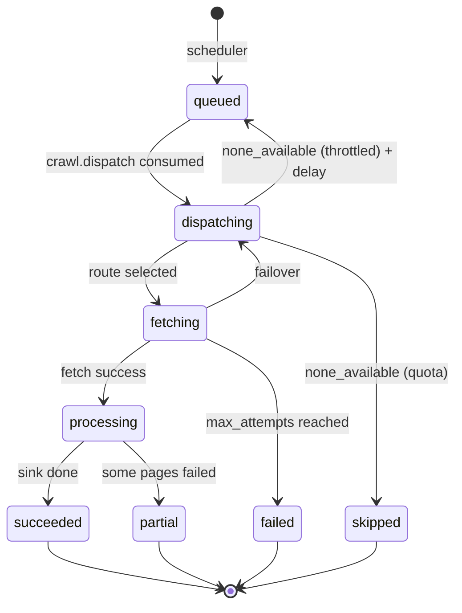

# QUEUE SPEC

## 1. Pilihan & Abstraksi

- Implementasi default: **BullMQ di Redis** (TS: `bullmq`; Python: paket `bullmq` di PyPI). Kompatibilitas BullMQ di Bun & interoperabilitas TS↔Python **wajib dibuktikan di spike S-03/S-04** sebelum dipakai.
- Fallback jika spike gagal: **Redis Streams** + consumer group, diimplementasikan tipis di `packages/queue` dan `workers-py/smip_queue`.
- Core hanya mengenal port:

```ts
// packages/core/src/ports/JobQueue.ts
export interface JobQueue {
  enqueue<T>(queue: QueueName, msg: Envelope<T>, opts?: EnqueueOptions): Promise<void>;
  enqueueBulk<T>(queue: QueueName, msgs: Envelope<T>[], opts?: EnqueueOptions): Promise<void>;
}
export interface EnqueueOptions {
  delayMs?: number; priority?: number;         // 1 = tertinggi
  jobId?: string;                              // = idempotencyKey
}
export interface QueueConsumer {
  consume<T>(queue: QueueName, handler: (msg: Envelope<T>, ctx: JobCtx) => Promise<void>, opts: ConsumerOptions): void;
}
```

Fitur yang **tidak** diasumsikan: fitur BullMQ Pro (group rate limit, dsb.). Rate limit per provider ditangani `packages/router` (Redis Lua), bukan queue.

## 2. Envelope (semua queue)

JSON Schema: `packages/contracts/schemas/envelope.v1.json`.

```json
{
  "v": 1,
  "type": "fetch.request",
  "id": "0192f0c4-8a4e-7c3b-9d2e-5b1a2f3c4d5e",
  "idempotency_key": "run.0192f0c4-….attempt.2.page.1",
  "tenant_id": "0192ef00-...",
  "created_at": "2026-09-27T10:00:00.000Z",
  "trace": { "traceparent": "00-4bf92f3577b34da6a3ce929d0e0e4736-00f067aa0ba902b7-01" },
  "payload": { }
}
```

Aturan:
- Payload **tidak pernah** berisi credential, token, cookie, atau password. Hanya `provider_account_id`.
- Ukuran payload maks 256 KB; item besar diteruskan via `raw_ref`/`batch_ref` (S3) — lihat `pipeline.items`.
- Setiap consumer **idempoten**: memproses pesan yang sama 2× tidak mengubah hasil.

## 3. Daftar Queue

| Queue | Producer | Consumer (runtime) | Tujuan | Concurrency/worker (awal) | Attempts | Backoff | Timeout | Prioritas |
|---|---|---|---|---|---|---|---|---|
| `crawl.dispatch` | scheduler, api (backfill), dispatch (failover) | worker-dispatch (bun) | compile query, route, enqueue fetch | 50 | 3 | exp 2s, jitter | 10 s | dari plan |
| `fetch.bun` | worker-dispatch | worker-fetch-bun (bun) | eksekusi connector runtime bun | 20 | 1 (retry diatur router) | — | per connector (default 120 s) | dari plan |
| `fetch.py` | worker-dispatch | worker-fetch-py (python) | eksekusi connector runtime python | 4 | 1 | — | per connector | dari plan |
| `fetch.resume` | worker-dispatch | worker-fetch-* | lanjutkan run async (poll) | 20 | 1 | delay `pollAfterMs` | 60 s | — |
| `fetch.result` | worker-fetch-* | worker-dispatch | laporan sukses/gagal → failover decision, update run | 50 | 5 | exp 1s | 10 s | — |
| `pipeline.items` | worker-dispatch (setelah fetch.result sukses) | worker-pipeline (bun) | match lokal, dedupe, geo, ads; post match → `ai.enrich`, post tak-match → `sink.analytics` langsung | 20 | 5 | exp 2s | 60 s | — |
| `ai.enrich` | worker-pipeline | worker-ai (python) | lang, sentiment, keyphrase (batch ≤ 64 item) | 2 (GPU) / N (CPU) | 5 | exp 5s | 300 s | realtime > backfill |
| `ai.llm_fallback` | worker-ai | worker-ai (python) | item low-confidence → LLM | 4 | 5 | exp 10s + respect 429 | 120 s | — |
| `sink.analytics` | worker-ai (post match), **worker-pipeline (post tak-match: `matches=[]`)** | worker-sink (bun) | batch insert ClickHouse + update run | 4 (**dipartisi** `hash(tenant,topic,post_id) mod N`, 1 consumer/partisi — DATA_MODEL §6.2) | 10 | exp 2s | 60 s | — |
| `realtime.notify` | worker-sink | api (bun) | publish SSE (Redis pub/sub) | 10 | 1 | — | 5 s | — |
| `engagement.refresh` | scheduler (cron) | worker-dispatch → fetch | re-fetch metrik post ≤ N jam | 10 | 3 | exp | — | rendah |
| `health.probe` | worker-health (cron) | worker-fetch-* | active probe | 5 | 1 | — | 30 s | tinggi |
| `connector.verify` | api (admin), cron | worker-fetch-* | capability verification | 2 | 1 | — | 600 s | rendah |
| `alert.evaluate` | worker-sink, cron 1m | worker-ops | evaluasi alert rule | 5 | 3 | exp | 30 s | — |
| `notify.send` | worker-ops | worker-ops | kirim email/webhook/telegram | 5 | 8 | exp 5s | 15 s | — |
| `export.generate` | api | worker-ops | CSV/XLSX → S3 | 2 | 3 | exp | 900 s | rendah |
| `reprocess.ai` | api (admin) | worker-ops → ai.enrich | re-score historis model baru | 1 | 3 | exp | — | terendah |
| `crawl.reaper` | cron 60 s | worker-ops | reset `crawl_runs` mandek non-final + `crawl_plans.inflight_run_id` (DATA_MODEL §3.9) | 1 | 1 | — | 30 s | tinggi |
| `retention.run` | cron harian | worker-ops | hapus partisi/raw kedaluwarsa | 1 | 3 | exp | 3600 s | — |
| `outbox.publish` | loop di worker-ops | worker-ops | publish perubahan config | 1 | ∞ | 1s | — | — |
| `dlq.<queue>` | framework | manusia/ops UI | pesan yang gagal final | — | — | — | — | — |

Angka concurrency adalah titik awal dan dikalibrasi dengan load test (TESTING §6).

## 4. Payload per Queue

### 4.1 `crawl.dispatch`
```json
{
  "crawl_run_id": "0192…",
  "crawl_plan_id": "0192…",
  "topic_id": "0192…",
  "topic_query_id": "0192…",
  "platform": "instagram",
  "operation": "search_keyword",
  "run_kind": "incremental",
  "window": { "since": "2026-09-27T09:45:00Z", "until": "2026-09-27T10:00:00Z" },
  "interval_sec": 900,
  "attempt_no": 1,
  "exclude_connector_ids": [],
  "exclude_account_ids": []
}
```

### 4.2 `fetch.bun` / `fetch.py`
```json
{
  "crawl_run_id": "0192…",
  "attempt_no": 1,
  "connector_id": "0192…",
  "connector_key": "apify.instagram",
  "connector_version": "1.2.0",
  "provider_account_id": "0192…",
  "reservation_id": "res_0192…",
  "request": {
    "requestId": "0192…",
    "idempotencyKey": "run.0192….attempt.1",
    "platform": "instagram",
    "operation": "search_keyword",
    "query": { "native": "demo dpr", "sourceNodeIds": ["n1"] },
    "window": { "since": "2026-09-27T09:45:00Z", "until": "2026-09-27T10:00:00Z" },
    "cursor": null,
    "pageLimit": 3,
    "maxItems": 300
  },
  "deadline_at": "2026-09-27T10:02:00Z"
}
```

### 4.3 `fetch.result`
```json
{
  "crawl_run_id": "0192…",
  "attempt_no": 1,
  "connector_id": "0192…",
  "provider_account_id": "0192…",
  "reservation_id": "res_0192…",
  "outcome": "success",
  "error": null,
  "items_ref": "s3://smip-raw/batches/0192…/1.jsonl.gz",
  "items_count": 142,
  "next_cursor": null,
  "has_more": false,
  "async_handle": null,
  "usage": { "requests": 3, "results": 142, "costUnits": null, "costUnitLabel": null },
  "duration_ms": 18231,
  "rate_limit_info": { "remaining": null, "resetAt": null }
}
```
Jika gagal: `"outcome": "error", "error": { "code": "RATE_LIMITED", "message": "…redacted…", "retry_after_ms": 60000, "scope": "account", "http_status": 429 }`.

Item canonical ditulis ke S3 sebagai JSONL (`items_ref`) karena bisa melebihi batas payload.

### 4.4 `pipeline.items`
```json
{
  "crawl_run_id": "0192…",
  "tenant_id": "0192…",
  "topic_id": "0192…",
  "topic_query_id": "0192…",
  "query_ast_version": 3,
  "items_ref": "s3://…/1.jsonl.gz",
  "items_count": 142
}
```
Untuk run **collection stream** (ADR-009): `tenant_id/topic_id/topic_query_id` = `null` dan diganti `"collection_stream_id": "0192…"`; worker-pipeline mengevaluasi item terhadap **semua** `topic_query` anggota stream (inverted index, CONNECTOR_SPEC §5) dan memecah hasil per (tenant, topic) saat enqueue `ai.enrich`.

**Post tak-match** (tidak cocok topic mana pun) tetap disimpan ke `posts` untuk backfill (ADR-009, P-17): worker-pipeline mengirim `sink.analytics` dengan `posts_ref` + `matches: []` — **tidak** lewat `ai.enrich` (hemat AI). Tanpa jalur ini aturan "simpan post tak-match" tidak bisa diimplementasikan.

### 4.5 `ai.enrich`
```json
{
  "batch_id": "0192…",
  "crawl_run_id": "0192…",
  "tenant_id": "0192…",
  "topic_id": "0192…",
  "priority_class": "realtime",
  "items": [
    { "platform": "x", "post_id": "18300…", "text": "…", "lang_hint": null, "is_new_post": true,
      "author": { "platform_user_id": "12345", "display_name": "Budi Santoso", "created_at": "2019-03-02T00:00:00Z" },
      "match": { "topic_query_id": "0192…" } }
  ],
  "items_ref": null,
  "models": { "sentiment": "active", "emotion": "active", "keyphrase": "active", "lang": "active" }
}
```
Jika `is_new_post=false` (post sudah pernah di-enrich untuk tenant lain), worker-ai **memakai hasil cache** (Redis `enr:{platform}:{post_id}:{model_version}`, TTL 14 hari) — sentiment/emotion bersifat per post, bukan per tenant, sehingga tidak dihitung ulang.

`author` hanya berisi sinyal minimal untuk inferensi demografi (nama tampilan & umur akun) — **tidak** diteruskan ke LLM kecuali memo S-23 mengizinkan (AI_SPEC §12.3).

**Demografi per akun** (gender/age): worker-ai mengecek `enrdem:{platform}:{author_id}:{model_version}` (TTL 30 hari) / tabel `author_demographics`. Cache miss → inferensi sekali per akun lalu simpan; hasil didenormalisasi ke match saat sink. Inferensi demografi tidak diulang per post.

### 4.6 `sink.analytics`
```json
{
  "batch_id": "0192…",
  "crawl_run_id": "0192…",
  "tenant_id": "0192…",
  "topic_id": "0192…",
  "posts_ref": "s3://…/posts.jsonl.gz",
  "matches": [
    { "platform": "x", "post_id": "18300…", "sentiment": "negative", "sentiment_score": 0.91,
      "emotion": "anger", "emotion_score": 0.88,
      "author_gender": "male", "author_gender_conf": 0.72, "author_followers": 10234,
      "media": [{ "type": "image", "url": "https://…", "thumb": null }],
      "author_age_range": "22_30", "author_age_conf": 0.55,
      "model_version": "sent-id-v3", "issues": ["gedung dpr", "elemen mahasiswa"],
      "hashtags": ["demodpr"], "parent_author_id": "998877",
      "geo_region_code": "31", "engagement": 1204, "engagement_known": true }
  ],
  "run_update": { "items_fetched": 142, "items_matched": 97, "items_new": 61, "new_high_watermark": "2026-09-27T09:59:31Z",
                  "run_outcome": "succeeded", "gap_window": null }
}
```

### 4.7 `realtime.notify`
`{ "tenant_id": "…", "topic_id": "…", "buckets": ["2026-09-27T09:55:00Z"], "platforms": ["x"] }`

### 4.8 `engagement.refresh`
`{ "platform": "x", "post_ids": ["…"], "tenant_ids": ["…"], "reason": "age<24h" }` → hasil: insert `engagement_snapshots`; jika engagement berubah, sink menulis pasangan `sign=-1` (nilai lama) & `sign=+1` (nilai baru) ke `topic_match_events` agar agregat engagement ikut benar.

## 5. Alur Status Crawl Run



**Penutupan run (I-14, migrasi 0014) — digerakkan counter DB, bukan `run_update` di payload:** `crawl_runs.pending_batches` = pesan hilir yang belum selesai. worker-dispatch **+1** per `pipeline.items`; worker-pipeline mengganti dirinya dengan N batch anak (`ai.enrich` + `sink.analytics` tak-match) → **−1+N**; worker-sink **−1** per batch selesai. Siapa pun yang terakhir mengubah counter (di bawah row lock) memanggil `finalizeRunIfDone`: bila `status='processing'` dan `pending_batches=0` → `succeeded` (tanpa `error_code`; `high_watermark` maju ke `max_published_at`, hanya run incremental) atau `partial` (ada `error_code`; celah `[window_from, min_published_at]` masuk `crawl_plans.gap_windows`, watermark **tidak** bergerak — CONNECTOR_SPEC §7). Run celah (backfill) yang sukses melepas entri celahnya; yang gagal membebaskan `run_id` celah untuk dicoba lagi. `sink.analytics.run_update` kini opsional/informatif.

Update status dilakukan dengan compare-and-set (`UPDATE … WHERE id=$1 AND status = ANY($expected)`), sehingga pesan duplikat tidak memundurkan status.

## 6. Scheduler

```text
every 15s (leader only):
  BEGIN
  SELECT id, … FROM crawl_plans
   WHERE status='active' AND next_run_at <= now()
   ORDER BY priority, next_run_at
   LIMIT 500
   FOR UPDATE SKIP LOCKED;
  for plan:
     if plan.inflight_run_id is not null and run not final:
         metrics.crawl_coalesced_total++ ; plan.next_run_at += interval ; continue
     if backpressure(plan.platform): skip with reason 'backpressure'
     if plan.gap_windows non-empty and not backpressure: enqueue satu gap run (run_kind=backfill, window=gap) 
     run ← INSERT crawl_runs(queued, window=[hw - overlap, now])
     plan.inflight_run_id ← run.id ; plan.next_run_at ← now + interval + jitter(±5%)
     outbox → enqueue crawl.dispatch (jobId = run.id)
  COMMIT
```
- `overlap` = `max(60 s, 0.2 × interval)` (config) karena provider bisa terlambat mengindeks.
- Jitter mencegah semua topik 5m menembak di detik yang sama.
- **Backpressure**: jika `waiting(fetch.*) > threshold` atau lag `pipeline.items` > threshold → plan prioritas rendah (backfill, interval ≥ 30m) ditunda dulu; realtime tetap jalan.
- **Cost guard (soft cap)**: saat cap biaya soft tenant/global tercapai → scheduler menaikkan interval efektif plan ke maksimum (throttle, **bukan stop**) + alert (CONNECTOR_SPEC §11, COST_MODEL §8). Hard quota tetap `skipped`.
- Enqueue via outbox agar tidak ada run "hantu" (row ada tanpa job atau sebaliknya).
- **Reaper (`crawl.reaper`, 60 s):** run yang masih non-final (`queued/dispatching/fetching/processing`) melewati `scheduled_for + deadline_grace` → set `failed`/`STUCK_RUN` (compare-and-set) **dan reset `crawl_plans.inflight_run_id`** agar plan tidak ter-coalesce selamanya bila worker mati. Mencegah plan "beku".

## 7. Retry, DLQ, Poison Message

- Retry *infrastruktur* (DB down, Redis blip) = attempts BullMQ di tabel §3.
- Retry *provider* = keputusan Router (CONNECTOR_SPEC §7), bukan attempts BullMQ → mencegah retry buta ke provider yang sama.
- Setelah attempts habis → pindah ke `dlq.<queue>` dengan `last_error`, `stack` (redacted), `attempts`. Ops UI: lihat, re-drive (enqueue ulang), atau discard (audit).
- Validasi schema gagal saat consume → langsung DLQ (poison), tidak di-retry.

## 8. Idempotency Keys

BullMQ 6 **menolak `:`** di custom jobId ("Custom Id cannot contain :" — S-03) → pemisah `.`.

| Queue | jobId / idempotency key |
|---|---|
| crawl.dispatch | `run.{crawl_run_id}.attempt.{n}` |
| fetch.* | `run.{crawl_run_id}.attempt.{n}` |
| pipeline.items | `pipe.{crawl_run_id}.{attempt}` |
| ai.enrich | `ai.{batch_id}` |
| sink.analytics | `sink.{batch_id}` (+ ClickHouse `sinkInsertSettings(batch_id)`: token + `deduplicate_blocks_in_dependent_materialized_views=1`; tabel sumber & target MV ber-`non_replicated_deduplication_window`) |
| health.probe | `hp.{connector}.{account}.{floor(now/interval)}` |
| export.generate | `exp.{export_id}` |

## 9. Tracing Across Queues

Producer menyuntikkan `traceparent` W3C ke envelope; consumer membuat span child. Satu `trace_id` mengikat: scheduler → dispatch → fetch (termasuk failover) → pipeline → ai → sink. `trace_id` disimpan di `crawl_runs.trace_id`.

## 10. Graceful Shutdown

SIGTERM → berhenti mengambil job baru → tunggu job berjalan hingga `shutdown_grace_sec` (default 60) → job yang belum selesai dikembalikan ke queue (BullMQ stalled detection / Streams XCLAIM) → release reservation rate/quota.
